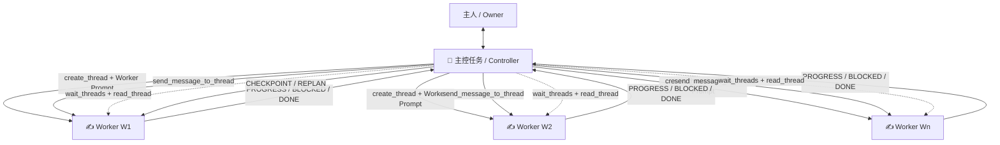
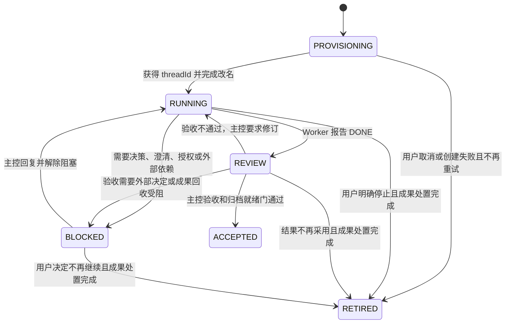

# Codex 独立任务并发调度 Skill 设计

## 1. 设计结论

建议将 Skill 命名为 `orchestrate-codex-tasks`。

它提供一种“主控任务（Controller）+ 独立 Worker 任务”的并发协作模式：

- 主控是用户当前所在的 Codex 任务，负责拆解、决策、调度、监控、验收和汇总。
- Worker 是通过新建任务能力创建的独立 Codex 任务，不是 Codex 内置子 Agent。
- 主控与 Worker 通过跨任务消息进行双向通信。
- Worker 的第一条派发提示词必须直接包含主控的 `threadId`；跨主机时还必须包含 `hostId`。
- 主控通过任务标题前缀表达实时状态，并向用户持续汇报进度和阻塞。
- 主控采用“消息推送 + 主动轮询”双通道监控，不能只依赖 Worker 主动回报。

本文统一使用 **Worker Prompt（派发提示词）** 这一术语。

## 2. 设计目标

### 2.1 必须实现

1. 在用户显式调用本 Skill 执行任务，或用自然语言明确要求创建独立 Codex 任务并发后，由主控主动创建 Worker。
2. 每个 Worker 是独立任务，拥有自己的 `threadId`、任务历史、权限边界和运行状态。
3. Worker Prompt 必须明确：
   - 这是主控拆出的一个子任务，但不是子 Agent。
   - Worker 的目标、范围、输入、输出和验收条件。
   - 主控的 `threadId`，以及需要时的 `hostId`。
   - 需要澄清、决策、授权或发现阻塞时，必须通知主控并暂停受影响工作。
   - 完成时必须先通知主控，再结束自己的任务。
4. 主控必须负责所有任务改名：
   - 主控：`👑`
   - Worker 运行中：`✍️`
   - Worker 已声明完成、等待主控验收：`🔍`
   - Worker 等待确认或阻塞：`⌛️`
   - Worker 已完成、通过验收且可人工归档：`✅`
   - Worker 已取消、废弃或被取代且可人工归档：`🗑️`
5. 主控必须持续观察 Worker：
   - 派发完成后立即向用户汇报。
   - Worker 状态变化时及时汇报。
   - 出现阻塞时立即汇报。
   - 长时间无状态变化时也要周期性给出简短心跳。
6. 主控必须验收 Worker 结果，而不能把 Worker 的“已完成”直接等价为总体任务完成。
7. 本 Skill 严禁自动归档。`✅` 与 `🗑️` 是通过归档就绪门的终态，表示用户可以人工归档；图标不触发归档、删除或 worktree 清理。
8. 允许 Worker 写代码；凡是会修改项目文件的 Worker，默认创建在独立 worktree 中。
9. 默认最多同时保留 8 个未完成 Worker；用户可以在每次运行开始前或运行期间明确调整该值。
10. 支持本地和远程 `hostId`，但没有用户或环境上的特殊要求时优先选择本地主机。
11. 主控必须区分“任务存活”和“有效进展”，在 Worker 过重、重复、范围膨胀或陷入长尾时主动请求 checkpoint，并在原授权内重规划。

### 2.2 不做什么

- 不调用 `spawn_agent`，不使用 Codex 内置子 Agent 协作链路。
- 不允许 Worker 自行继续创建 Worker，除非用户对某次运行明确授权多级调度。
- 不让多个 Worker 无边界地同时修改同一批文件。
- 不通过 Skill 绕过工具权限、审批、沙箱或用户授权。
- 不把当前 Codex App 暴露的高层工具误写成稳定的公开 OpenAI API。
- 不创建无上限 Worker；使用有限并发和波次调度。
- 不自动归档任何主控或 Worker 任务。
- 不因时间阈值自动停止 Worker；时间只触发效率审查。
- 不把 commentary 数量、频繁轮询或逐步微授权当成吞吐量。

### 2.3 I18N 与运行语言

每次运行在首次用户可见动作前确定 `runLanguage`：

- 用户明确指定会话或协调语言时，以该指令为准。
- 否则根据触发编排的用户自然语言选择：英文为 `en`，中文为 `zh-CN`。
- 代码、路径、命令、引用材料和交付物目标语言不参与判断。
- 中英文混合且仍然含糊时，使用最后一个有实际语义的用户自然语言句子。
- `runLanguage` 写入运行账本，并传入每个 Worker Prompt。
- 用户运行中明确要求切换语言时，主控更新账本并向所有活跃 Worker 发送 `LANGUAGE_UPDATE`。

`runLanguage` 控制主控回复、任务标题、Worker Prompt、进度、阻塞、验收和最终汇总。协议枚举、字段名、工具名、ID、路径、命令和代码不翻译。交付物语言独立于协调语言，例如中文请求生成英文 README 时，协调仍使用中文。

Codex Skill 没有用于控制模型响应语言的 `agents/openai.yaml` 字段；IDE 的 `chatgpt.localeOverride` 也只控制 UI。因此该能力必须由 Skill 指令和 Worker Prompt 协议实现，而不是依赖界面 locale。

## 3. 官方依据与当前工具映射

OpenAI 官方 Codex App Server 文档定义了线程和轮次的底层生命周期：

- `thread/start` 创建新线程。
- `thread/name/set` 设置或更新线程的人类可读名称。
- `turn/start` 向指定 `threadId` 添加用户输入并启动一轮处理。
- `thread/list`、`thread/read` 和线程状态事件用于观察线程。

官方文档：

- [Codex App Server：生命周期](https://learn.chatgpt.com/docs/app-server#lifecycle-overview)
- [Codex App Server：API 概览](https://learn.chatgpt.com/docs/app-server#api-overview)
- [Codex App Server：启动或恢复线程](https://learn.chatgpt.com/docs/app-server#start-or-resume-a-thread)
- [Codex Skills](https://developers.openai.com/codex/build-skills)

在当前 Codex 桌面运行时中，主控不应直接拼装 App Server JSON-RPC，而应调用应用提供的高层工具：

| 目的 | 官方 App Server 原语 | 当前 Codex App 工具 |
|---|---|---|
| 创建独立任务 | `thread/start` | `codex_app.create_thread` |
| 设置任务标题 | `thread/name/set` | `codex_app.set_thread_title` |
| 向现有任务发消息 | `turn/start` + `threadId` | `codex_app.send_message_to_thread` |
| 查找任务 | `thread/list` | `codex_app.list_threads` |
| 读取任务状态和近期内容 | `thread/read` | `codex_app.read_thread` |
| 等待状态变化或完成 | 线程/轮次事件 | `codex_app.wait_threads` |
| 查找可用项目 | 客户端项目目录配置 | `codex_app.list_projects` |
| 在 Local、worktree 或主机之间转移任务及代码 | 客户端 Git/worktree 工作流 | `codex_app.handoff_thread` |
| 等待转移完成 | 客户端操作状态 | `codex_app.get_handoff_status` |

这些 `codex_app.*` 名称是当前运行时工具契约，不应描述为面向外部开发者的稳定公共 API。Skill 在每次运行前都要确认工具是否可用；工具可能需要通过 `tool_search` 延迟发现。

官方 App Server 虽然提供 `thread/archive`，当前 Codex App 也可能暴露 `set_thread_archived`，但它们不属于自动编排工具集合。本 Skill 的硬性规则是永不自动归档；用户明确要求由 Codex 归档时，必须作为自动编排之外的独立、精确目标操作处理。

### 3.1 创建项目内 Worker

先查找项目，再创建任务：

```text
list_projects({})

create_thread({
  "prompt": "<完整 Worker Prompt>",
  "target": {
    "type": "project",
    "projectId": "<PROJECT_ID>",
    "environment": {
      "type": "local"
    }
  }
})
```

只读 Worker 可以使用 `local`。凡是会写项目文件的 Worker，默认使用独立 worktree：

```text
create_thread({
  "prompt": "<完整 Worker Prompt>",
  "target": {
    "type": "project",
    "projectId": "<PROJECT_ID>",
    "environment": {
      "type": "worktree"
    }
  }
})
```

默认省略 `startingState`，让 worktree 从项目默认分支开始。只有用户明确要求基于当前 checkout（包括未提交修改）或某个现有分支时，才设置起始状态：

```text
"environment": {
  "type": "worktree",
  "startingState": {
    "type": "working-tree"
  }
}
```

或者：

```text
"environment": {
  "type": "worktree",
  "startingState": {
    "type": "branch",
    "branchName": "<EXISTING_BRANCH_OR_REF>"
  }
}
```

注意：

- 不要主动指定 `model` 或 `thinking`，除非用户明确要求。
- 直接创建通常返回 `threadId` 和 `hostId`。
- worktree 创建可能先返回 `clientThreadId`。在实际 `threadId` 产生前，它处于 `PROVISIONING` 状态，不能调用 `wait_threads` 或按线程 ID 改名。
- worktree 只适用于 Git 仓库；非 Git 项目不能把写入型 Worker 伪装成 worktree 任务。
- `startingState.type=working-tree` 会把当前 checkout 和未提交改动作为起点，因此必须有用户对该起始状态的明确要求。
- 如果 Worker 明显依赖未提交改动，但用户没有明确指定起始状态，主控必须在创建前澄清，不能擅自改成 `working-tree`、提交用户改动或假设默认 worktree 能看到它们。
- worktree 中缺失的忽略文件可以由项目已有的 `.worktreeinclude` 规则复制；Skill 不得自行把凭据文件加入该规则。

### 3.2 创建 projectless Worker

适用于不依赖当前代码仓库的一般研究、资料整理或方案比较：

```text
create_thread({
  "prompt": "<完整 Worker Prompt>",
  "target": {
    "type": "projectless",
    "directoryName": "<可选目录名>"
  }
})
```

### 3.3 改名

给当前主控改名时省略 `threadId`：

```text
set_thread_title({
  "title": "👑 [R7K2] 调度｜设计任务并发 Skill"
})
```

给 Worker 改名时传入 Worker 的 `threadId`：

```text
set_thread_title({
  "threadId": "<WORKER_THREAD_ID>",
  "title": "✍️ [R7K2-W1] 核对线程工具契约"
})
```

### 3.4 跨任务消息

主控向 Worker 发送后续指令：

```text
send_message_to_thread({
  "threadId": "<WORKER_THREAD_ID>",
  "hostId": "<WORKER_HOST_ID>",
  "prompt": "<结构化后续指令>"
})
```

Worker 向主控发送状态：

```text
send_message_to_thread({
  "threadId": "<CONTROLLER_THREAD_ID>",
  "hostId": "<CONTROLLER_HOST_ID>",
  "prompt": "<结构化状态消息>"
})
```

同一主机且工具不要求 `hostId` 时可以省略它。不能传入空字符串伪装有效 ID。

### 3.5 主动观察

```text
wait_threads({
  "targets": [
    {
      "threadId": "<WORKER_THREAD_ID>",
      "hostId": "<WORKER_HOST_ID>",
      "afterCursor": "<可选游标>"
    }
  ],
  "timeoutMs": 30000
})
```

`wait_threads` 单次最多观察 8 个目标。默认并发度正好对应一个监控集合；如果用户把并发度调高到 8 以上，主控必须按稳定的 Worker 分组切成多个监控集合，并采用轮转快照，不能遗漏后面的 Worker。

状态含糊、消息缺失或需要核对证据时调用：

```text
read_thread({
  "threadId": "<WORKER_THREAD_ID>",
  "hostId": "<WORKER_HOST_ID>",
  "turnLimit": 5,
  "includeOutputs": false
})
```

### 3.6 worktree 成果转移

写代码 Worker 完成实现和验证后，代码仍位于它自己的 worktree。主控必须先验收，再按依赖顺序逐个把已验收成果转移到 Local；不得让多个 Worker 同时向 Local 回收代码。

首选使用当前运行时的 Handoff：

```text
handoff_thread({
  "threadId": "<WORKER_THREAD_ID>"
})
```

调用返回 `operationId` 和 `revision` 后，等待操作变化：

```text
get_handoff_status({
  "operationId": "<OPERATION_ID>",
  "afterRevision": <REVISION>,
  "waitMs": 30000
})
```

规则：

- 只在 Worker 已停止写入且主控完成单 Worker 验收后发起 Handoff。
- Handoff 会中断仍在运行的目标任务，因此不能拿它充当普通消息或监控工具。
- 回收前检查 Local 当前改动和其他已集成 Worker 的结果；发现覆盖或冲突风险时把 Worker 标记为 `⌛️`，先解决冲突。
- Handoff 成功后在 Local 上重新运行组合验证；Worker 报告完成后先标记为 `🔍`，归档就绪门通过后才能标记为 `✅`。
- 如果 Handoff 工具不可用，必须在派发写入型 Worker 前确定替代集成方案。替代方案可以是用户明确授权的本地提交/补丁交付，但不得自动推送远程仓库。
- “允许写代码”不自动授权提交、推送、开 PR 或发布。除非用户的原始请求明确包含这些动作，否则 Worker 只修改并验证代码。

Codex 托管 worktree 有独立的产品级清理策略。禁止自动归档不等于 Skill 能永久保留底层 worktree。因此，标记 `✅` 前必须完成原范围要求的 Handoff 或用户认可的持久化；标记 `🗑️` 前也必须回收仍有价值的成果，或明确记录不再采用。仍需恢复的唯一成果存在时只能保持 `⌛️`。

### 3.7 本地与远程主机

`list_projects` 会返回本地及已连接远程主机上的项目。主控按以下优先级选择：

1. 用户明确指定的主机。
2. 能满足任务依赖的本地同项目 worktree。
3. 本地只读项目环境。
4. 仅当本地环境缺少必要能力、依赖或项目，而远程存在明确匹配时，选择远程项目。

创建任务时传入对应项目的 `projectId`，不自行构造 `hostId`。创建成功后记录工具返回的真实 `hostId`，并在后续 `wait_threads`、`read_thread` 和 `send_message_to_thread` 中复用。

跨主机写代码 Worker 完成后，先把结果转移到本地主机上的匹配项目 worktree：

```text
handoff_thread({
  "threadId": "<REMOTE_WORKER_THREAD_ID>",
  "destinationHostId": "local"
})
```

完成后必须从 Handoff 状态中更新 Worker 的主机信息，再根据需要执行本地主机上的 worktree-to-Local Handoff。远程项目匹配不唯一、目标主机不可用或代码无法安全转移时，Worker 进入 `⌛️`，由主控向用户报告，不能用推送远程分支来绕过确认。

## 4. 总体架构



核心原则是 **单一决策中心、多个执行单元、双向通信、主控验收**。

Worker 可以分析、实现或验证，但以下职责只属于主控：

- 是否改变总体范围。
- 是否接受风险或扩大权限。
- 如何解决 Worker 之间的冲突。
- Worker 是否过重、重复或进入低效长尾，以及是否继续、批量放行、拆分或替换。
- 如何整合最终结果。
- 是否需要向用户提出澄清。
- 何时把 Worker 标记为完成。

## 5. 激活与授权边界

OpenAI 官方 Skill 文档说明，Skill 可以通过两种方式激活：

1. 用户显式提及 `$skill-name`。
2. 用户请求与 Skill 的 `description` 匹配时，由 Codex 隐式选择。

参考：[Codex Skills：显式与隐式调用](https://developers.openai.com/codex/build-skills#how-codex-uses-skills)。

本 Skill 推荐允许隐式选择，但必须把“加载 Skill”和“获准创建独立任务”分开判断：

```yaml
policy:
  allow_implicit_invocation: true
```

### 5.1 执行触发

满足以下任一条件时，立即进入编排执行模式：

1. 用户显式调用 Skill 并要求它执行一个任务：

   ```text
   用 $orchestrate-codex-tasks 并发完成这次重构。
   ```

2. 用户没有写 Skill 名称，但明确要求创建独立 Codex 任务：

   ```text
   创建几个独立 Codex 任务并行调查这些问题，由当前任务统一汇总。
   用主控 + Worker 模式执行。
   把这项工作拆成多个后台任务同时做，并通过跨任务消息协调。
   ```

第二类属于“隐式选择 Skill、显式授权创建任务”：Skill 可以自动被识别，同时 `create_thread` 所要求的用户授权也已经成立。

### 5.2 只建议、不创建

以下表达只表示用户可能需要并发，不足以授权创建独立任务：

```text
这个任务能不能并行？
帮我快一点。
你自己决定是否拆分。
并发执行一下。
```

遇到这类弱信号时：

1. 可以说明该工作适合或不适合独立任务编排。
2. 可以给出建议的 Worker 数量和拆分方案。
3. 在用户明确同意创建独立 Codex 任务前，不得调用 `create_thread`。

### 5.3 不触发

以下情况不得使用本 Skill：

- 用户明确要求使用 Codex 子 Agent。
- 用户说的“并发”指 shell 命令并行、程序多线程、异步网络请求或 CI job。
- 任务只有一个很短的动作。
- 工作高度耦合，拆分后需要频繁共享隐含上下文，独立 Worker 不会带来收益。
- 用户只要求解释、评审或设计本 Skill，而没有要求实际启动 Worker。
- 用户明确要求不要创建新任务或不要后台运行。

### 5.4 `description` 识别规则

Skill 的 frontmatter `description` 应同时写清正向触发词和排除条件。推荐文案：

```yaml
---
name: orchestrate-codex-tasks
description: Coordinate the current Codex task as a Controller with multiple independent Codex Worker tasks/threads through task creation, cross-task messages, status-title updates, health checks, adaptive replanning, worktree isolation, and result synthesis. Run all visible coordination in English or Chinese to match the user's orchestration request. Use only when the user explicitly invokes this skill to execute work or clearly asks for separate, independent, or background Codex tasks, a Controller + Worker workflow, cross-task coordination, “主控 + Worker”, “独立任务并发”, or “跨任务并发”. Do not use for Codex subagents, generic requests to work faster, vague parallelism, shell/program concurrency, simple tightly coupled work, or requests that do not authorize creating new Codex tasks.
---
```

`description` 应让 Codex 识别强意图，而不是只要出现“并发”二字就触发。

### 5.5 授权范围

本次授权只覆盖当前用户请求范围内的 Worker 创建，不自动授权：

- Worker 再创建 Worker。
- 扩大外部系统写入范围。
- 提交、推送、发布、删除或其他高影响动作。
- 自动归档任何任务。

主控获得执行授权后，可以根据任务依赖主动决定创建多少 Worker、何时派发以及如何排队。

## 6. 运行标识与主控地址

每次调度生成一个短 `runId`，例如 `R7K2`。每个 Worker 获得稳定的 `workerId`，例如 `W1`。

主控在派发前必须得到并校验：

```text
controllerThreadId
controllerHostId  # 跨主机时必填，同主机可选
runId
```

按照当前设计，主控将 `controllerThreadId` 直接写入每个 Worker Prompt。Worker 不负责猜测或搜索主控。

主控 ID 获取优先级：

1. 使用当前 Codex 运行时已经提供的调用方 `threadId`。
2. 如果当前表面没有直接提供：
   - 先把当前任务临时改成带唯一 `runId` 的主控标题。
   - 用 `list_threads(query=runId)` 查找。
   - 必须得到唯一且与当前项目/状态一致的匹配，才可继续派发。
3. 如果仍不能可靠确定主控 ID，停止创建 Worker，并把这一点作为阻塞报告给用户。

这项前置校验不可省略，因为没有正确主控地址的 Worker 无法满足“阻塞和完成都必须主动通知主控”的协议。

## 7. 任务拆解与并发策略

### 7.1 默认并发度

- `maxActiveWorkers` 默认值为 8。
- “活跃”指尚未进入 `ACCEPTED` 或 `RETIRED` 的 Worker，包括 `PROVISIONING`、`RUNNING`、`REVIEW` 和 `BLOCKED`。阻塞任务仍需主控持续管理，因此仍占一个槽位。
- 用户可以在初始 Prompt 中明确设置其他正整数，也可以在运行期间升高或降低。
- 当子任务多于并发槽位时，按依赖关系分波次派发。
- 并发上限是容量上限，不是创建目标。只有 3 个真正独立的子任务时，即使上限为 8 也只创建 3 个 Worker。
- 不做无限自动扩容，也不因某个 Worker 较慢就重复创建相同 Worker。

并发值解析规则：

```text
requested = 用户本次运行明确指定的值，否则为 8
effective = min(requested, 当前可执行且值得独立派发的子任务数, 当前环境已知能力上限)
```

- 非正整数、含糊范围或超出当前环境能力时，主控先说明可接受值并请求修正。
- 若环境没有声明额外上限，不擅自把用户值静默压回 8。
- 用户把并发度提高到 8 以上时，主控先说明将使用多组监控，然后按新值补充派发队列。
- 用户降低并发度时，不自动中断已经创建的 Worker；停止派发新 Worker，等待活跃数自然下降到新上限。只有用户明确要求立即停止具体 Worker 时，才发送停止指令。
- 所有并发调整都写入运行账本，并立即向用户报告“旧值 → 新值、当前活跃数、排队数”。

默认值 8 与 `wait_threads` 单次最多 8 个目标相匹配，可以在一个等待集合中覆盖默认运行的全部 Worker。

### 7.2 只派发适合独立执行的工作

一个合格 Worker 任务必须满足：

- 目标单一且有明确完成定义。
- 输入可以在 Prompt 中完整描述，或 Worker 能在授权范围内读取。
- 输出可单独验收。
- 与其他 Worker 的依赖明确。
- 写入范围不重叠，或运行在隔离 worktree。

以下内容默认留给主控：

- 高度耦合、需要连续决策的核心实现。
- 多个 Worker 结果的最终取舍和整合。
- 用户偏好、业务权衡和风险接受。
- 共享接口的最终定稿。

### 7.2.1 派发前任务重量审查

每个 Worker 规划 2–5 个可观察里程碑，并记录首个健康检查点。下列是软拆分信号：

- 跨越多个顶层子系统或工具链。
- 包含两个以上可以独立验收的生产目标。
- 同时承担实现、规格、TDD、完整回归和最终集成。
- 写入边界横跨多个顶层目录，或存在大量未知前置。
- 预计需要连续多轮主控决策才能推进。

命中任一信号时，主控优先继续拆分；确实因共享状态、单一脏 worktree 或强依赖无法拆分时，必须记录不可拆原因、里程碑、预计最慢合法命令和第一次效率复查时间。重量审查不是机械文件数限制，也不能为了拆分而制造多个写入者。

### 7.3 建立小型依赖图

主控先建立一个轻量 DAG：

```text
W1: 核对工具契约 ─┐
                  ├─> C: 汇总设计
W2: 设计状态机 ───┤
W3: 设计测试场景 ─┘
```

只创建当前依赖已经满足的 Worker。被阻塞 Worker 不应占用主控全部注意力；主控可以继续推进不依赖该阻塞的工作流。如果阻塞影响全局范围、验收标准或关键接口，则整个运行进入用户决策阻塞。

### 7.4 项目环境选择

| 子任务类型 | 推荐环境 |
|---|---|
| 一般研究、资料比较 | `projectless` |
| 只读代码分析 | 当前项目 `local` |
| 任意项目文件写入 | 独立 `worktree`，并在 Prompt 中声明文件所有权 |
| 多个可能冲突的写入任务 | 独立 `worktree` + 依赖图 + 串行回收 |
| 明确依赖当前 checkout 和未提交修改 | 独立 `worktree` + 用户明确授权 `startingState.type=working-tree` |
| 非 Git 项目的写入任务 | 不能使用 worktree；先向用户说明降级方案 |

即使 Worker 位于不同 worktree，主控也必须给出独占写入边界。隔离只能防止文件系统互相覆盖，不能消除逻辑冲突：

```text
你只允许修改：
- src/parser/**
- tests/parser/**

不得修改：
- package.json
- 公共接口文件
- 其他 Worker 的所有权范围
```

只有在 worktree 不可用、用户仍明确要求继续，并且文件边界完全不重叠时，才允许写入型 Worker 降级到共享 `local`。降级前必须向用户报告风险；不得静默改变隔离策略。

### 7.5 多于 8 个 Worker 的监控

用户明确把 `maxActiveWorkers` 调到 8 以上时，主控把活跃 Worker 按稳定顺序分成 `M1...Mn`，每组最多 8 个：

1. 每个监控周期先对所有组执行 `timeoutMs: 0` 的增量快照，处理完成和需要关注的状态。
2. 再对下一轮轮转组执行一次最长约 15 秒的阻塞等待。
3. 每轮更新各 Worker 的 cursor；组的顺序不因单个 Worker 完成而任意重排。
4. 任一 Worker 的 `BLOCKED` 或完成状态一旦被发现，立即处理，不等整轮结束。
5. 保证所有活跃 Worker 至少每 60 秒被主动观察一次。

这个分组只解决工具单次 8 目标的限制，不表示主控应该为了填满并发值而制造低价值子任务。

## 8. 标题与状态机

### 8.1 标题格式

主控：

```text
👑 [<runId>] <阶段>｜<总体目标>
```

示例：

```text
👑 [R7K2] 拆解｜设计任务并发 Skill
👑 [R7K2] 调度｜设计任务并发 Skill
👑 [R7K2] 跟进 8 个 Worker｜设计任务并发 Skill
👑 [R7K2] 重规划｜设计任务并发 Skill
👑 [R7K2] 汇总｜设计任务并发 Skill
👑 [R7K2] 等待主人确认｜设计任务并发 Skill
👑 [R7K2] 完成｜设计任务并发 Skill
```

Worker：

```text
<状态图标> [<runId>-<workerId>] <动宾短语>
```

示例：

```text
✍️ [R7K2-W1] 核对线程工具契约
🔍 [R7K2-W1] 核对线程工具契约｜等待主控验收
⌛️ [R7K2-W1] 核对线程工具契约｜等待权限确认
✅ [R7K2-W1] 核对线程工具契约
🗑️ [R7K2-W1] 核对线程工具契约｜已由 W2 取代
```

图标必须是标题的第一个字符，不在图标前增加其他标记。不得使用 `📋` 表达报告、审计、设计或“无合入物”；交付物类型写入后缀，生命周期验收通过后仍使用 `✅`。

健康度不增加新的生命周期图标。效率审查中继续推进时使用 `✍️ ...｜效率审查`；暂停等待新计划时使用 `⌛️ ...｜等待重规划`。账本另存 `HEALTHY/AT_RISK/STALLED`。

### 8.2 Worker 状态转换



标题映射：

| 内部状态 | 标题前缀 | 说明 |
|---|---|---|
| `PROVISIONING` | 暂无或 `⌛️` | 尚未获得真实 `threadId` |
| `RUNNING` | `✍️` | 正在执行或修订 |
| `REVIEW` | `🔍` | Worker 已声明完成，主控正在验收或整合 |
| `BLOCKED` | `⌛️` | 等待确认、澄清、授权、依赖或故障处理 |
| `ACCEPTED` | `✅` | 成功完成并通过归档就绪门；可人工归档 |
| `RETIRED` | `🗑️` | 已取消、废弃、失效或被取代，并通过归档就绪门；可人工归档 |

Worker 自称完成后，主控先进入 `REVIEW` 并改为 `🔍`；只有验收、成果回收和归档就绪门通过才改为 `✅`。

失败或停止不直接标记为 `✅`。仍需决定或恢复成果时使用 `⌛️`；确认停止、完成成果处置并记录替代关系后使用 `🗑️`。`✅` 与 `🗑️` 均不自动归档。

## 9. Worker Prompt 模板

以下为协议示意；实际完整模板分别位于 `references/worker-prompt.en.md` 与 `references/worker-prompt.zh-CN.md`，由主控按 `runLanguage` 选择、填充后传给 `create_thread`。

```text
你是一个独立 Codex Worker 任务，不是 Codex 子 Agent。
你由一个主控任务派发，只负责下面定义的单一子任务。

协调地址
- runId: {{RUN_ID}}
- workerId: {{WORKER_ID}}
- controllerThreadId: {{CONTROLLER_THREAD_ID}}
- controllerHostId: {{CONTROLLER_HOST_ID_OR_OMIT}}

任务
- 目标：{{OBJECTIVE}}
- 背景与输入：{{CONTEXT}}
- 允许范围：{{IN_SCOPE}}
- 禁止范围：{{OUT_OF_SCOPE}}
- 执行主机：{{WORKER_HOST}}
- 执行环境：{{LOCAL_OR_WORKTREE_OR_PROJECTLESS}}
- worktree 起始状态：{{STARTING_STATE_OR_NOT_APPLICABLE}}
- 文件写入边界：{{WRITE_BOUNDARY}}
- 成果回收方式：{{INTEGRATION_PLAN}}
- 期望交付物：{{DELIVERABLES}}
- 验收与验证：{{ACCEPTANCE}}
- 可观察里程碑：{{MILESTONES}}
- 首个健康检查点与已知长命令：{{HEALTH_CHECKPOINT}}

强制协作协议
1. 这是主控拆出的子任务。不要创建子 Agent、其他 Codex 任务或新的 Worker。
2. 开始后先确认你理解目标；如发现目标本身不完整，立即按 BLOCKED 协议通知主控。
3. 遇到以下任一情况时，不得自行猜测：
   - 需要产品、业务、架构或用户偏好决策；
   - 需要澄清相互冲突的要求；
   - 需要扩大权限、写入范围或外部影响；
   - 缺少关键输入、依赖或凭据；
   - 继续执行可能造成不可逆或高风险结果。
4. 发生阻塞时：
   - 暂停受影响的动作；
   - 使用 send_message_to_thread 向 controllerThreadId 发送 BLOCKED 消息；
   - 给出阻塞原因、已经确认的事实、可选方案、推荐方案和不决策的影响；
   - 等待主控回复。可以继续处理与阻塞无关且明确安全的工作。
5. 有实质性里程碑时向主控发送 PROGRESS，包含当前里程碑、新关闭和剩余验收项及带理由的 ETA；长命令开始前报告预期墙钟时间和安全中断边界。
6. 保存最大 `controllerSeq`，只执行更大序号；重复或更旧命令只确认、不重复执行。
7. 收到 CHECKPOINT 时在安全边界暂停新阶段，回报已完成/剩余验收、文件与未提交成果、冗余工作、可拆分单元、ETA 和下一条不可中断命令。
8. 收到 REPLAN 时只调整原授权内的执行形状，不扩大范围或降低验收。
9. 完成时必须先向主控发送 DONE 消息，包含结果、证据、验证、文件或链接、残余风险；发送后再结束本任务。DONE 只是完成声明，主控验收期间使用 `🔍`。
10. 收到 STOP 时停止受影响工作，保留可恢复证据，用 PROGRESS 和 `next: none` 确认停止；目标没有真正完成时不得声称 DONE。
11. 主控负责最终决策、`✅/🗑️` 终态和归档就绪审计。不要向主人宣称总体任务已经完成。
12. 如果允许写代码：
   - 只修改“文件写入边界”允许的路径；
   - 在独立 worktree 内完成实现与测试；
   - 不自行 Handoff 到 Local；
   - 不提交、推送、开 PR 或发布，除非任务范围明确授权；
   - DONE 中必须附 `git status --short`、变更文件清单、测试命令与结果。

消息调用
send_message_to_thread({
  "threadId": "{{CONTROLLER_THREAD_ID}}",
  "hostId": "{{CONTROLLER_HOST_ID_OR_OMIT}}",
  "prompt": "<按下列消息格式填写>"
})

消息格式
[ORCH run={{RUN_ID}} worker={{WORKER_ID}} seq={{SEQ}} type={{TYPE}}]
summary: <一句话状态>
details:
- <关键事实或产出>
milestone: <当前可观察里程碑>
completed:
- <本次新关闭的验收项；没有则 none>
remaining:
- <剩余验收项>
estimate: <预计剩余时间；未知时给出理由>
next:
- <下一步；DONE 时写 none>
needs:
- <需要主控决定的事项；无则写 none>
evidence:
- <文件、命令、测试、链接或其他证据>

TYPE 只能使用：
- ACCEPTED
- PROGRESS
- BLOCKED
- DONE
```

`seq` 从 `001` 单调增加，用于主控去重和恢复。

如果 Worker 发现 `send_message_to_thread` 不可用，它必须在自己的最终输出中以 `BLOCKED` 开头并停止需要协调的工作。主控通过 `wait_threads` 或 `read_thread` 发现这一状态后接管处理。

主控发送给 Worker 的后续消息使用独立类型，避免与 Worker 状态混淆：

```text
[ORCH run={{RUN_ID}} worker={{WORKER_ID}} controllerSeq={{SEQ}} command={{COMMAND}}]
decision: <主控决定或 none>
instructions:
- <下一步>
acceptanceDelta:
- <验收条件变化；无则 none>
```

`COMMAND` 只能使用：

- `DECISION`：回答 Worker 的阻塞问题。
- `CHECKPOINT`：要求 Worker 在安全边界暂停新阶段并返回成果与剩余工作快照。
- `REPLAN`：在原始授权内调整顺序、批量授权或剩余职责。
- `REVISION`：验收未通过，要求在原范围内修订。
- `SCOPE_UPDATE`：用户已授权范围变化。
- `LANGUAGE_UPDATE`：用户明确要求切换协调语言。
- `STOP`：用户明确要求停止，或原任务已失去价值。

`controllerSeq` 必须严格单调增加；恢复后从账本中的 `lastControllerSeq` 继续，不能复用旧序号。

## 10. 主控调度算法

### 阶段 A：预检

1. 确认用户对独立任务并发有显式授权。
2. 确认以下关键工具可用：
   - `create_thread`
   - `set_thread_title`
   - `send_message_to_thread`
   - `list_threads`
   - `list_projects`
   - `wait_threads`
   - `read_thread`
3. 如果本次包含代码写入，再确认 `handoff_thread` 和 `get_handoff_status` 可用；若不可用，必须先确定并告知用户替代成果回收方式。
4. 获取并校验当前主控的 `threadId`；跨主机时获取 `hostId`。
5. 解析 `maxActiveWorkers`：用户本次明确值优先，否则使用 8。
6. 生成 `runId`。
7. 将主控改名为：

   ```text
   👑 [runId] 拆解｜总体目标
   ```

8. 拆分子任务，建立依赖关系、写入边界、起始状态、目标主机、成果回收方式和验收条件。
9. 使用 `list_projects` 解析项目：本地优先，远程项目必须唯一匹配且确实满足任务需要。
10. 选择最多 `maxActiveWorkers` 个当前可执行且值得独立派发的 Worker。

任何关键工具或主控地址缺失时，不得假装能够完成独立任务编排。应立即向用户报告阻塞。

### 阶段 B：派发

对每个 Worker：

1. 生成唯一 `workerId`。
2. 填充完整 Worker Prompt，直接注入主控 `threadId` 和 `hostId`。
3. 根据读写属性选择环境：写项目文件默认 `worktree`，只读任务可用 `local`，非项目任务用 `projectless`。
4. 调用 `create_thread`。
5. 记录返回的：
   - `threadId` 或 `clientThreadId`
   - `hostId`
   - 目标环境
   - worktree 起始状态
   - 目标、依赖、写入边界和成果回收方式
   - 当前状态和最新 `seq`
6. 获得真实 `threadId` 后立即改名为：

   ```text
   ✍️ [runId-workerId] 子任务名称
   ```

7. 所有首批 Worker 派发后，主控改名为：

   ```text
   👑 [runId] 跟进 N 个 Worker｜总体目标
   ```

8. 向用户报告：
   - 已派发多少 Worker。
   - 每个 Worker 的任务名称。
   - `maxActiveWorkers`、当前活跃数和排队数。
   - 每个写入型 Worker 的 worktree/起始状态。
   - 是否使用远程主机以及原因。
   - 主控自己正在推进的工作。

### 阶段 C：监控

主控使用双通道：

1. **推送通道**：接收 Worker 的跨任务 `ACCEPTED`、`PROGRESS`、`BLOCKED`、`DONE`。
2. **拉取通道**：
   - 活跃 Worker 不超过 8 时，每轮用一个 `wait_threads` 集合等待至多约 30 秒。
   - 活跃 Worker 超过 8 时，按 7.5 节的监控分组执行轮转快照。
   - 使用返回的 cursor 增量观察。
   - 状态不清楚时调用 `read_thread`。

拉取通道不可省略，因为 Worker 消息可能延迟、排队、发送失败，或者 Worker 在发送 `DONE` 前异常结束。

用户可见汇报节奏：

- 派发完成：立即汇报。
- Worker 阻塞：立即汇报。
- Worker 完成并通过验收：立即汇报。
- 发生重试、范围变化或任务替换：立即汇报。
- 运行中没有状态变化：约每 60 秒给出一次简短进度心跳。

不要把每次 30 秒轮询都变成无信息量消息；只有达到用户侧心跳时间或发生状态变化时才汇报。

### 阶段 C.1：效率审查与重规划

主控不把消息频率当成进展，持续更新 `currentMilestone`、`closedAcceptanceItems`、`remainingAcceptanceItems`、`lastUsefulProgressAt` 和 `estimatedRemaining`。

以下任一条件是软触发，不是自动停止：

1. 约 30 分钟没有关闭验收项，且不在已声明长命令窗口；长命令超过预计约 2 倍或无执行迹象也触发。
2. 连续 3 条 `PROGRESS` 没有关闭里程碑。
3. 发生 3 次可预见的逐步放行往返。
4. 新增原计划之外的验收族、顶层子系统或写入边界。
5. 出现 timeout、重复诊断、上下文压缩、序号重复或同一失败路径反复尝试。
6. `activeCount=1`、`queuedCount=0` 持续约 15 分钟，且剩余工作可拆分。

触发后：

1. 健康度改为 `AT_RISK`，主控标题改为 `👑 [runId] 重规划｜总体目标`。
2. 向 Worker 发送 `CHECKPOINT`，要求在安全边界暂停新阶段并返回已完成/剩余验收、文件与未提交成果、冗余执行、可拆分工作和 ETA。
3. 主控在原始授权内选择：
   - 继续并设置下一个可验证里程碑和复查时间；
   - 用 `REPLAN` 一次性授权已核对的有界 manifest，首个 nonzero/timeout 即停；
   - 删除被更强证据覆盖的重复执行，但不降低验收标准；
   - 收窄原 Worker，把独立剩余工作拆给新 Worker；
   - 一次有界重规划后仍无进展时，在保护成果后替换 Worker。
4. 脏 worktree 的唯一成果未 checkpoint/Handoff/持久化前，不创建第二个写入者接管同一边界。
5. 立即向用户报告触发原因、决定、并发变化、下一检查点和风险。

只有一次有界重规划后仍没有有效进展，或确实等待外部决定时，才进入 `STALLED/BLOCKED`。时间阈值本身不能触发 `STOP`、`RETIRED` 或自动归档。

### 阶段 D：处理阻塞

收到 `BLOCKED` 后：

1. 立即把 Worker 改名为 `⌛️`。
2. 判断主控是否已经拥有作出决定所需的权限和信息。
3. 如果可以在原始用户意图内安全决策：
   - 记录决策。
   - 通过 `send_message_to_thread` 回复 Worker。
   - Worker 恢复后改回 `✍️`。
4. 如果需要主人确认：
   - 主控标题改成 `👑 [runId] 等待主人确认｜总体目标`。
   - 立即向用户说明阻塞、选项、主控建议和影响。
   - 不替用户作出超出授权的决定。
5. 不依赖该阻塞的其他 Worker 可以继续运行。
6. 如果阻塞影响总体目标、共同接口或最终验收，整个运行进入全局阻塞。

### 阶段 E：验收和整合

收到 `DONE` 或观察到 Worker 结束后：

1. 立即进入 `REVIEW` 并将 Worker 改名为 `🔍 ...｜等待主控验收`。
2. 用 `read_thread` 核对完整结果和验证证据。
3. 检查是否满足 Worker Prompt 中的验收条件。
4. 不通过：
   - 恢复 `RUNNING` 和 `✍️`。
   - 向 Worker 发送具体修订要求。
5. 通过：
   - 只读成果直接记录到主控汇总。
   - 写入型成果按依赖顺序逐个 Handoff；跨主机时先转移到本地匹配项目。
   - 在 Local 上运行组合验证；Handoff 后出现整合冲突时改为 `⌛️`，由主控在 Local 解决或请求用户决定，不能让 Worker 无边界地继续修改 Local。
   - 只有原范围完成、组合验证通过、必要成果已持久化、没有待决策或唯一未回收成果时，才通过归档就绪门并将 Worker 改名为 `✅`。
   - 报告、审计、设计、DAG 或候选包本来不要求合入时，同样可通过验收并使用 `✅`，标题后缀可以说明“无合入物”。
   - 释放并发槽位，派发依赖已经满足的下一波 Worker。
6. 用户取消、任务失效或 Worker 被取代时，先发送 `STOP` 并处置可恢复成果；记录 `replacementWorkerId`、`terminalReason` 和 `archiveReady=true` 后改为 `🗑️`。
7. 所有 Worker 结果完成后，主控改名为：

   ```text
   👑 [runId] 汇总｜总体目标
   ```

8. 主控独立验证整合结果，而不是只拼接 Worker 文本或只相信单个 worktree 的测试。

### 阶段 F：完成并保留任务

1. 主控向用户给出：
   - 总体结果。
   - Worker 状态摘要。
   - 关键决策和阻塞处理。
   - 验证结果。
   - 未解决风险。
2. 主控标题改为：

   ```text
   👑 [runId] 完成｜总体目标
   ```

3. `✅` 表示成功完成，`🗑️` 表示取消、废弃或被取代；两者都已通过归档就绪门，可以由用户直接人工归档。
4. 所有 `✅` 和 `🗑️` Worker 必须继续保留在任务列表中，直到用户人工归档或明确要求 Codex 对精确目标执行归档。
5. 本 Skill 的自动编排流程不得调用 `set_thread_archived` 或其他归档能力。
6. 归档与分支、worktree、文件删除是不同操作；终态图标不授权自动清理。

## 11. 主控运行账本

主控在上下文中维护一个紧凑账本：

| 字段 | 含义 |
|---|---|
| `runId` | 本次调度标识 |
| `workerId` | Worker 稳定标识 |
| `threadId` | Worker 任务 ID |
| `clientThreadId` | worktree 尚在创建时的临时 ID |
| `hostId` | Worker 所在主机 |
| `title` | 期望标题 |
| `state` | `PROVISIONING/RUNNING/REVIEW/BLOCKED/ACCEPTED/RETIRED` |
| `objective` | 子任务目标 |
| `dependencies` | 前置 Worker |
| `environment` | `local/worktree/projectless` |
| `startingState` | worktree 起始状态；不适用时为空 |
| `writeBoundary` | 文件所有权 |
| `integrationPlan` | Handoff 或用户明确授权的替代回收方式 |
| `lastSeq` | 已处理的最新 Worker 消息序号 |
| `lastControllerSeq` | Worker 已应用的最新主控命令序号 |
| `cursor` | `wait_threads` 增量游标 |
| `result` | 验收后的结果摘要 |
| `health` | `HEALTHY/AT_RISK/STALLED`，与生命周期正交 |
| `currentMilestone` | 当前可观察里程碑 |
| `closedAcceptanceItems` | 已关闭的验收项 |
| `remainingAcceptanceItems` | 剩余验收项 |
| `lastUsefulProgressAt` | 最近可复核成果或验收关闭时间 |
| `estimatedRemaining` | Worker 当前 ETA 及理由 |
| `decisionRoundTrips` | 可预见的逐步放行往返数 |
| `scopeDeltaCount` | 新增验收族、子系统或写入边界次数 |
| `timeoutCount` | timeout 次数 |
| `nextHealthReviewAt` | 下一次效率复查点 |
| `archiveReady` | 仅归档就绪门通过后的 `ACCEPTED/RETIRED` 为 `true` |
| `terminalReason` | 成功完成摘要或废弃原因 |
| `replacementWorkerId` | 被取代时填写，否则为 `none` |

运行级账本还必须保存：

| 字段 | 含义 |
|---|---|
| `runLanguage` | 本次运行的协调语言，`en` 或 `zh-CN` |
| `controllerThreadId` | 主控任务 ID |
| `controllerHostId` | 主控所在主机；同主机且工具不要求时可省略 |
| `maxActiveWorkers` | 当前有效并发上限，默认 8 |
| `activeCount` | 所有非 `ACCEPTED/RETIRED` Worker 数 |
| `queuedCount` | 尚未创建且依赖未满足或等待槽位的 Worker 数 |
| `monitorGroups` | 每组最多 8 个 Worker 的稳定监控分组 |
| `localPreferred` | 固定为 `true`，除非用户明确指定远程优先 |
| `oneToOneSince` | 只有一个活跃 Worker 且无队列时的起始时间；否则为空 |

如果主控因压缩或恢复而丢失局部状态，可通过：

1. `runId` 搜索任务标题。
2. `list_threads` 重建 Worker 列表。
3. `read_thread` 重建最近状态。
4. 根据消息中的 `seq` 去重，并从 `lastControllerSeq` 继续严格递增的主控命令。

任务标题中的 `runId-workerId` 是恢复机制的一部分，不只是装饰。

## 12. 异常与恢复策略

### 12.1 worktree 只返回 `clientThreadId`

- 状态设为 `PROVISIONING`。
- 暂不调用 `wait_threads`、`set_thread_title(threadId=...)` 或跨任务发消息。
- 通过任务列表和 `runId-workerId` 标记解析真实 `threadId`。
- 达到有限重试阈值仍无法解析时，报告用户并标记为 `⌛️`，不重复创建相同 Worker。

### 12.2 Worker 没有发送 DONE

- `wait_threads` 发现任务结束后调用 `read_thread`。
- 如果结果完整，正常验收。
- 如果结果不完整，向原 Worker 发送修订消息。
- 原 Worker 不可恢复时，最多自动创建 1 个替代 Worker；再次失败则报告用户。

### 12.3 重复或乱序消息

- 按 `runId + workerId + seq` 去重。
- 只接受比 `lastSeq` 更新的消息。
- `ACCEPTED/RETIRED` 后收到旧 `PROGRESS` 或 `DONE` 不回退状态。
- 主控发出修订后，可开启新的执行轮次，但仍沿用同一个 Worker ID 和递增序号。

### 12.4 标题更新失败

- 任务账本状态是逻辑真相，标题是用户界面投影。
- 有限重试改名。
- 改名持续失败时向用户说明，但不因此丢弃 Worker 结果。

### 12.5 Worker 请求超范围动作

- 标记 `⌛️`。
- 不扩大权限。
- 主控判断是否需要用户授权。
- 用户拒绝后，主控缩小 Worker 范围或终止对应工作流。

### 12.6 用户改变目标

- 主控先判断哪些 Worker 仍然有效。
- 对需要调整的 Worker 发送结构化 `SCOPE_UPDATE` 指令；只有用户已经授权的新范围才能写入该消息。
- 对已经失去价值的 Worker 发送 `STOP`。先回收仍有价值的成果、记录替代 Worker 和终止原因；归档就绪门通过后状态改为 `RETIRED`，标题使用 `🗑️`。
- 更新主控标题和用户进度摘要。

### 12.7 worktree 起始状态不正确

- 如果 Worker 创建后发现缺少必要的当前修改，立即发送 `BLOCKED`，不要在错误基线上继续实现。
- 主控不得自动提交当前 checkout、复制整个未提交目录或重新创建多个重复 Worker。
- 主控向用户说明默认分支、`working-tree` 和现有分支三个起始方案的差异。
- 用户确认后最多重建 1 次该 Worker；旧任务在确认没有待恢复的唯一成果并记录替代 Worker 后标记为 `🗑️ ...｜基线错误，已由 <workerId> 取代`。

### 12.8 Handoff 冲突或失败

- Handoff 操作必须通过 `get_handoff_status` 确认终态，不能因工具已返回 `operationId` 就视为成功。
- 冲突时停止后续成果回收，保留 Worker worktree，不做破坏性 Git 清理。
- 主控把相关 Worker 标记为 `⌛️`，列出冲突文件、已集成成果和建议处理顺序。
- 修复后重新运行 Local 组合验证；只有验证通过才标记 `✅`。

### 12.9 远程主机失联

- 使用账本中的最后有效 `hostId` 做一次有限状态核对。
- 不在本地创建“同名替代 Worker”并假装拥有远程未同步成果。
- 如果远程 Worker 只做只读分析，可以在用户目标范围内创建 1 个本地替代 Worker。
- 如果远程 Worker 已写代码但尚未 Handoff，立即向用户报告成果可能仍滞留远程，不标记 `✅`。

### 12.10 运行中调整并发度

- 升高：更新 `maxActiveWorkers`，从已经规划的就绪队列补充派发，不重新拆分已运行任务。
- 降低：更新上限并暂停新派发；现有 Worker 自然完成，不自动取消。
- 调整到超过 8：重建 `monitorGroups`，保持每组最多 8 个并启用轮转监控。
- 用户给出的值无法满足当前工具或环境约束时，明确报告 `requested` 与可执行的 `effective`，不得静默替换。

### 12.11 Worker 过重、冗余或陷入长尾

- 先区分合法长命令、真实阻塞和“消息活跃但验收不关闭”。
- 触发软阈值后发送 `CHECKPOINT`，不因时间直接停止或复制 Worker。
- 能在原范围优化时发送 `REPLAN`：批量授权有界 manifest、移除重复执行或拆分独立剩余工作。
- Worker 持有未提交唯一成果时，先形成安全 checkpoint 或完成成果回收，再创建替代写入 Worker。
- 一次有界重规划后仍无有效进展，健康度改为 `STALLED`，生命周期进入 `BLOCKED`；保护成果后最多创建 1 个替代 Worker。
- 恢复时 `controllerSeq` 必须从 `lastControllerSeq` 继续，重复或旧命令不得再次执行。

## 13. Skill 文件结构

建议实现为仓库级 Skill：

```text
.agents/
└── skills/
    └── orchestrate-codex-tasks/
        ├── SKILL.md
        ├── agents/
        │   └── openai.yaml
        └── references/
            ├── protocol.md
            ├── tool-contracts.md
            ├── worker-prompt.en.md
            └── worker-prompt.zh-CN.md
```

职责：

- `SKILL.md`
  - 三档触发判断：执行、只建议、不触发。
  - `runLanguage` 选择、传播和切换。
  - 独立任务创建授权检查。
  - 主控六阶段调度算法。
  - 并发、写入和验收守则。
  - 严禁自动归档。
  - 何时读取两个 reference。
- `references/tool-contracts.md`
  - 官方 App Server 原语。
  - 当前 `codex_app.*` 工具调用形态。
  - project/local/worktree/projectless、本地/远程主机选择。
  - worktree 起始状态、Handoff 与成果回收。
  - 默认 8 并发及大于 8 时的监控分组。
  - 工具缺失和返回值边界。
- `references/protocol.md`
  - 双语 Prompt 的选择规则。
  - 状态消息格式。
  - 英文和中文标题状态机。
  - `LANGUAGE_UPDATE`。
  - 恢复和去重规则。
- `references/worker-prompt.en.md`
  - `runLanguage=en` 时使用的完整英文 Worker Prompt。
- `references/worker-prompt.zh-CN.md`
  - `runLanguage=zh-CN` 时使用的完整中文 Worker Prompt。
- `agents/openai.yaml`
  - UI 名称和默认 Prompt。
  - `allow_implicit_invocation: true`，依靠严格 `description` 识别强意图。

不建议加入脚本：

- 调度动作必须由模型调用 Codex App 工具，普通 shell/Python 脚本不能替代这些受控工具。
- 标题生成、状态表和 Prompt 填充足够简单，脚本只会增加维护面。
- `agents/openai.yaml` 当前只能声明 MCP 类型的工具依赖，不能用它强制声明 Codex App 内置工具，所以工具预检必须写在 `SKILL.md`。

建议 UI 元数据：

```yaml
interface:
  display_name: "Codex Task Orchestrator"
  short_description: "Coordinate independent Codex tasks as Controller and Workers"
  default_prompt: "Use $orchestrate-codex-tasks to split this request into independent Codex Worker tasks, coordinate them, and synthesize the result in the language of the user's orchestration request."

policy:
  allow_implicit_invocation: true
```

## 14. GitHub 发布与安装

### 14.1 推荐仓库布局

沿用本设计的仓库级目录：

```text
<repo>/
├── README.md
├── README.zh-CN.md
├── DESIGN.md
└── .agents/
    └── skills/
        └── orchestrate-codex-tasks/
            ├── SKILL.md
            ├── agents/
            │   └── openai.yaml
            └── references/
                ├── protocol.md
                ├── tool-contracts.md
                ├── worker-prompt.en.md
                └── worker-prompt.zh-CN.md
```

上传 GitHub 后，Skill 的稳定路径为：

```text
https://github.com/BillSJC/orchestrate-codex-tasks/tree/master/.agents/skills/orchestrate-codex-tasks
```

### 14.2 推荐安装方式：让 Codex 使用 `$skill-installer`

用户在任意 Codex 任务中发送：

```text
Use $skill-installer to install the skill from
https://github.com/BillSJC/orchestrate-codex-tasks/tree/master/.agents/skills/orchestrate-codex-tasks
```

也可以用中文：

```text
请使用 $skill-installer，从下面的 GitHub 地址安装这个 Skill：
https://github.com/BillSJC/orchestrate-codex-tasks/tree/master/.agents/skills/orchestrate-codex-tasks
```

当前内置安装器会：

1. 从公开 GitHub 仓库直接下载；必要时回退到 Git sparse checkout。
2. 将 Skill 安装到 `$CODEX_HOME/skills/orchestrate-codex-tasks`，默认即 `~/.codex/skills/orchestrate-codex-tasks`。
3. 在安装后的下一轮对话中提供该 Skill。
4. 如果新 Skill 没有出现，用户重启 Codex 后再检查。

私有 GitHub 仓库可以使用机器已有的 Git 凭据，或安装环境已有的 `GITHUB_TOKEN` / `GH_TOKEN`。不得让用户把访问令牌直接粘贴进普通任务 Prompt。

官方说明：

- [安装本地 Skill](https://developers.openai.com/codex/build-skills#install-curated-skills-for-local-use)
- [Skill 的发现位置](https://developers.openai.com/codex/build-skills#where-to-save-skills)

### 14.3 仓库级安装

如果某个团队只想在一个代码仓库中使用该 Skill，可把发布仓库中的：

```text
.agents/skills/orchestrate-codex-tasks/
```

复制或同步到目标仓库相同路径：

```text
<target-repo>/.agents/skills/orchestrate-codex-tasks/
```

Codex 从目标仓库或其子目录启动时会自动发现它。这个方式适合把 Skill 与团队代码一起版本控制。

### 14.4 用户级手动安装

OpenAI 官方文档列出的用户级发现目录是：

```text
$HOME/.agents/skills/orchestrate-codex-tasks/
```

用户也可以把 GitHub 仓库中的 Skill 目录复制到该位置。Codex 支持符号链接，因此开发者可以保留本地 Git clone，并从用户级 Skill 目录链接到 clone 中的 Skill。

### 14.5 更新现有安装

Codex 会自动检测 Skill 文件变化；如果更新没有出现，重启 Codex。更新方式取决于安装范围：

1. **仓库级副本**：更新包含 `.agents/skills/orchestrate-codex-tasks` 的仓库 checkout。
2. **`$skill-installer` 用户级副本**：内置安装器在目标目录已存在时会停止，不能直接覆盖。先把旧副本移动到所有 Skill 扫描目录之外的备份位置，再从同一 GitHub URL 重新安装。
3. **手动用户级副本**：更新 `$HOME/.agents/skills/orchestrate-codex-tasks` 指向的内容或符号链接。

安装器使用 `$CODEX_HOME/skills`，通常是 `$HOME/.codex/skills`；官方手动发现目录还包括 `$HOME/.agents/skills`。更新前必须确认实际生效副本，避免在两个位置留下不同版本。

推荐用户发送：

```text
请安全更新用户级 $orchestrate-codex-tasks 安装。
把现有副本移动到所有 Skill 扫描目录之外的备份位置，不要删除。
然后使用 $skill-installer 从下面的地址重新安装：
https://github.com/BillSJC/orchestrate-codex-tasks/tree/master/.agents/skills/orchestrate-codex-tasks
确认没有旧的同名用户级副本仍可被发现。
不要创建任何 Worker。
```

备份不能继续放在 `.agents/skills`、`$HOME/.agents/skills` 或 `$CODEX_HOME/skills` 内，因为 Codex 不合并同名 Skill；重复副本可能同时出现并使用不同指令。新任务验证通过后，再由用户决定是否删除扫描路径之外的备份。

### 14.6 安装后触发

安装后的确定性测试方式：

```text
使用 $orchestrate-codex-tasks，把下面工作拆成两个独立 Codex Worker 任务并发执行，由当前任务统一协调和汇总：……
```

如果 UI 或当前表面支持 Skill 选择器，也可以先选择 `orchestrate-codex-tasks`，再提交任务。

对于广泛的组织级分发，OpenAI 官方文档更推荐把 Skill 打包为 Plugin；本项目第一版保持为可从 GitHub 安装的独立 Skill。

## 15. 验收测试

### 场景 1：两个只读 Worker 正常完成

- 主控改名为 `👑`。
- 创建两个独立任务。
- 两个 Worker 标题为 `✍️`。
- Prompt 中都含有正确主控 `threadId`。
- Worker 发送 `DONE`。
- 主控先改为 `🔍`，验收和归档就绪门通过后改为 `✅` 并汇总。

### 场景 2：Worker 需要用户决策

- Worker 发送 `BLOCKED`。
- Worker 停止受影响操作。
- 主控把 Worker 标题改成 `⌛️`。
- 主控立即向用户报告选项和建议。
- 用户决定后，主控回复 Worker，并改回 `✍️`。

### 场景 3：Worker 完成但验收失败

- Worker 发送 `DONE`。
- 主控先改为 `🔍`，不立即改为 `✅`。
- 主控发现验证不足，发送修订要求。
- Worker 恢复为 `✍️`，修订通过后再次进入 `🔍`，最终才改为 `✅`。

### 场景 4：跨任务消息工具不可用

- 预检发现 `send_message_to_thread` 不可用。
- 主控不创建无法满足协议的 Worker。
- 向用户报告当前表面不支持该编排模式。

### 场景 5：worktree 异步创建

- `create_thread` 只返回 `clientThreadId`。
- 主控记录 `PROVISIONING`，不误用临时 ID。
- 获得真实 `threadId` 后完成改名和监控。

### 场景 6：共享目录写入冲突

- 主控发现 Worker 写入边界重叠。
- 改用 worktree、重新划分文件所有权或串行执行。
- 不允许两个 Worker 无保护地同时修改公共接口。

### 场景 7：主控恢复

- 通过 `runId` 搜索 Worker。
- 用 `read_thread` 恢复状态。
- 重复消息不导致状态倒退。

### 场景 8：用户中途改需求

- 主控向相关 Worker 发送调整指令。
- 对已经无价值的工作流发送 `STOP`。
- 回收有价值成果并记录替代关系后改为 `🗑️`。
- 向用户报告影响和新的并发计划。

### 场景 9：写代码 Worker 的默认隔离与回收

- 两个写代码 Worker 都以独立 `worktree` 创建，而不是共享 `local`。
- Prompt 分别声明文件边界和成果回收方式。
- Worker 在各自 worktree 完成测试并发送 `DONE`。
- 主控先标记 `🔍`，逐个验收和 Handoff，在 Local 运行组合测试并通过归档就绪门后才标记 `✅`。
- 整个过程不自动提交、推送或归档。

### 场景 10：任务依赖未提交修改

- 主控发现默认分支不包含必要输入。
- 在用户明确要求前，不使用 `startingState.type=working-tree`。
- 用户确认以当前 checkout 为起点后，再创建 worktree Worker。

### 场景 11：默认 8 并发

- 至少有 10 个真正独立且已就绪的子任务。
- 首波最多创建 8 个 Worker，其余进入队列。
- 一个 Worker 验收并释放槽位后，才派发下一项。
- 默认全部活跃 Worker 位于同一个 `wait_threads` 监控集合。

### 场景 12：用户把并发度调为 12

- 主控接受明确正整数 12，不静默压回 8。
- 活跃 Worker 分为最多 8 个目标的稳定监控组。
- 所有组至少每 60 秒获得一次主动观察。
- 主控向用户报告新上限、活跃数和排队数。

### 场景 13：运行中把并发度从 8 降到 3

- 已经运行的 Worker 不被自动中断。
- 主控停止新派发，等待活跃数自然降至 3。
- 后续最多维持 3 个未完成 Worker。

### 场景 14：远程写入 Worker

- 本地环境优先；只有用户指定或本地缺少必要能力时选择远程项目。
- Worker Prompt 同时获得主控 `threadId` 和 `hostId`。
- Worker 完成后先 Handoff 到本地匹配项目 worktree，再串行回收到 Local。
- 任一步骤失败时标记 `⌛️` 并报告，不用远程 push 绕过确认。

### 场景 15：英文编排

- 用户用英文明确调用 Skill。
- `runLanguage=en`。
- 主控汇报、任务标题、英文 Worker Prompt、阻塞选项、验收和最终汇总全部使用英文。
- `ACCEPTED/PROGRESS/BLOCKED/DONE`、字段名、路径、命令和代码保持原样。

### 场景 16：中文编排生成英文交付物

- 用户用中文要求并发生成英文 README。
- `runLanguage=zh-CN`，主控和 Worker 的协调内容使用中文。
- README 交付物使用英文，不触发协调语言切换。
- 只有用户明确要求“后续请用英文协调”时，主控才发送 `LANGUAGE_UPDATE`。

### 场景 17：无合入物任务完成

- Worker 交付只读审计、报告、设计或 DAG，并发送 `DONE`。
- 主控进入 `🔍`，核对内容、证据和可访问路径。
- 原 Prompt 不要求代码或合入；验收通过后标记为 `✅ ...｜已验收，无合入物`。
- 不使用 `📋`，用户可以直接人工归档该任务。

### 场景 18：Worker 被替代

- 原 Worker 因不可恢复故障或目标变化失去价值。
- 主控发送 `STOP`，回收有价值成果，并记录 `replacementWorkerId`。
- 仍有唯一未提交成果待恢复时保持 `⌛️`，不得提前终止。
- 成果处置完成后标记为 `🗑️ ...｜已由 <workerId> 取代`，用户可以直接人工归档。

### 场景 19：终态任务的人工归档

- `✅` 与 `🗑️` 的账本都包含 `archiveReady=true` 和 `terminalReason`。
- Skill 不自动调用归档工具。
- 用户自行点击归档，或另行明确要求 Codex 归档精确目标时，可以直接归档。
- 归档不会被当作删除分支、worktree 或文件的授权。

### 场景 20：派发前发现 Worker 过重

- 一个候选 Worker 同时跨越三个顶层子系统、多个独立验收目标，并承担实现、规格、TDD 和全量回归。
- 主控触发重量审查，优先拆成带依赖关系的多个 Worker。
- 强依赖导致不可拆时，Prompt 记录 2–5 个里程碑、不可拆原因、首个健康检查点和预计最慢命令。

### 场景 21：一对一长尾与逐步微授权

- 运行只剩一个活跃 Worker，队列为空，连续约 15 分钟仍有可拆分剩余工作。
- 主控发送 `CHECKPOINT`，发现 4 个已核对且互斥的测试批次。
- 主控发送一次 `REPLAN`，批量授权完整 manifest 并要求首个 nonzero/timeout 即停，不再逐批等待批准。

### 场景 22：消息活跃但没有有效进展

- Worker 连续 3 条 `PROGRESS` 没有关闭验收项，且新增原计划之外的验收族。
- 健康度改为 `AT_RISK`，主控进入 `重规划`，要求 checkpoint。
- 新验收族属于原范围时拆分或收窄；超出原范围时请求用户授权，不能让原 Worker 静默吸收。

### 场景 23：脏 worktree 不安全拆分

- 过重 Worker 持有唯一未提交成果。
- 主控不得直接创建第二个写入 Worker 接管同一文件边界。
- 先按原请求授权完成 checkpoint、Handoff、commit 或替代持久化；稳定基线形成后才拆分，或只并发互不重叠的只读工作。

### 场景 24：恢复后主控命令去重

- 上下文压缩后主控恢复 `lastControllerSeq=014`。
- 下一条命令必须使用更大的序号；重复的 `controllerSeq=014` 被 Worker 确认但不重复执行。
- 消息频繁不被推断为 `HEALTHY`，健康度从最近可复核成果和范围变化恢复。

## 16. 完成标准

Skill 实现完成后，应满足：

- 所有 Worker 都是 `create_thread` 创建的独立任务。
- 不出现 `spawn_agent` 或 Worker 自扩散。
- 每个 Worker Prompt 都包含主控 `threadId`。
- 每个 Worker Prompt 都包含正确的 `runLanguage`，并使用对应的完整语言模板。
- 跨主机 Worker 同时获得主控 `hostId`。
- 英文请求的主控回复、标题、Worker 消息和汇总使用英文；中文请求对应使用中文。
- 交付物语言不反向改变协调语言；显式语言切换能够传播到所有活跃 Worker。
- 每个任务标题始终符合图标状态规则。
- `✍️/🔍/⌛️/✅/🗑️` 分别映射运行、验收、阻塞、成功终态和废弃终态；不使用 `📋` 表达交付物类型。
- 每个阻塞都能进入主控并被用户看见。
- 主控同时使用 Worker 消息和主动监控。
- 每个 Worker 有 2–5 个可观察里程碑，并在 `PROGRESS` 中区分有效验收关闭与普通活动。
- 主控对过重、冗余、范围膨胀、一对一长尾和 timeout 执行软触发健康检查；时间本身不自动停止 Worker。
- `CHECKPOINT/REPLAN` 只调整原授权内的执行形状，不降低验收或扩大权限。
- 写入型 Worker 的唯一未提交成果在另一个写入者接管前得到保护。
- `controllerSeq` 严格递增，恢复后重复命令不重复执行。
- Worker 的 `DONE` 必须先进入 `REVIEW` 和 `🔍`，再经过主控验收。
- 写代码 Worker 默认位于独立 worktree，并具备明确文件所有权。
- worktree 成果经过串行 Handoff、Local 组合验证和归档就绪门后才标记 `✅`。
- 无合入物任务按原 Prompt 验收通过后同样标记 `✅`。
- 取消、废弃或被取代的任务只有在成果处置、替代记录和归档就绪门通过后才标记 `🗑️`。
- 默认 `maxActiveWorkers` 为 8，用户可以在运行前或运行中调整。
- 超过 8 个活跃 Worker 时，监控分组仍覆盖全部 Worker。
- 远程 Worker 正确记录和传递 `hostId`，且本地主机保持默认优先级。
- 主控在运行期间不让用户超过约 60 秒看不到任何有意义的进度信息。
- 最终结果由主控整合并独立验证。
- 全部完成后任务仍保留；自动编排不调用归档工具，`✅/🗑️` 表示用户可以人工归档。

## 17. 推荐默认值

| 配置 | 默认值 |
|---|---|
| Skill 名称 | `orchestrate-codex-tasks` |
| 激活方式 | 显式调用，或强意图自然语言隐式识别 |
| 隐式调用 | 启用，但 `description` 仅匹配明确创建独立任务的意图 |
| 协调语言 | 根据用户编排请求选择 `en` 或 `zh-CN` |
| 语言切换 | 运行期间仅响应用户明确要求，并向活跃 Worker 发送 `LANGUAGE_UPDATE` |
| 最大活跃 Worker | 8；用户可按本次运行主动调整 |
| Worker 是否可再派生 | 否 |
| 写代码 Worker 环境 | 独立 `worktree` |
| worktree 默认起点 | 项目默认分支；用户明确要求时才改用当前 working tree 或现有分支 |
| 只读 Worker 环境 | 本地项目优先，也可使用 `projectless` |
| 主机选择 | 支持远程 `hostId`，本地主机优先 |
| 成果回收 | 验收后串行 Handoff，随后运行 Local 组合验证 |
| `wait_threads` 等待窗口 | 约 30 秒 |
| 用户进度心跳 | 最长约 60 秒 |
| Worker 可观察里程碑 | 2–5 个 |
| 无验收关闭效率审查 | 约 30 分钟；合法长命令窗口除外 |
| 一对一长尾效率审查 | `activeCount=1`、`queuedCount=0` 且仍可拆分时约 15 分钟 |
| 无里程碑关闭 PROGRESS | 连续 3 条触发审查 |
| 可预见逐步放行往返 | 3 次触发审查 |
| 长命令偏离 | 超过已声明预计墙钟约 2 倍触发审查，不自动停止 |
| 调度健康度 | `HEALTHY/AT_RISK/STALLED`，与生命周期正交 |
| Worker 自动重建 | 同一失败最多 1 次 |
| Worker 验收中标识 | Worker `DONE` 后、主控验收期间使用 `🔍` |
| Worker 成功终态 | 归档就绪门通过后使用 `✅`，可以人工归档 |
| Worker 废弃终态 | 成果处置和替代记录完成后使用 `🗑️`，可以人工归档 |
| 自动归档 | 严禁；自动编排不调用归档工具 |
| 决策中心 | 仅主控 |

该默认方案使用 8 个槽位提高吞吐量，同时用 worktree 隔离、单组监控、串行成果回收和主控验收控制冲突。

## 18. 已确认的实施决策

第一版采用以下已确认值：

1. 统一使用 **Prompt** 和 **Worker Prompt**。
2. Worker 允许写代码；写项目文件时优先且默认使用独立 worktree。
3. 只对非常明确的独立 Codex 任务并发意图进行隐式识别；弱并发信号只提出建议，不创建任务。
4. 支持远程 `hostId`，但默认优先本地主机。
5. `maxActiveWorkers` 默认 8，用户可以在运行前或运行中主动调整。
6. Worker 的 `DONE` 先使用 `🔍`；成功终态使用 `✅`，废弃或被取代的终态使用 `🗑️`。
7. `✅` 与 `🗑️` 都表示任务已完成归档就绪审计、可以人工归档，但永不自动归档。
8. 无合入物不使用独立图标；报告、审计、设计或候选包通过原范围验收后同样使用 `✅`。
9. 英文请求使用英文协调，中文请求使用中文协调；交付物语言与协调语言独立。
10. 主控必须判断 Worker 是否过重、冗余、范围膨胀或陷入低效长尾，并通过 `CHECKPOINT/REPLAN` 在原授权内优化。
11. 时间阈值只触发健康审查，不能自动停止、废弃或替代 Worker。
12. 健康度不新增生命周期图标；效率审查使用标题后缀，真正等待重规划时使用 `⌛️`。

当前没有阻塞第一版建设的待确认项。运行时出现的基线选择、远程项目歧义、额外权限或成果回收冲突，均由 Skill 的预检和 `BLOCKED` 协议处理，不需要在设计阶段预先猜测。

## 19. 建设计划与就绪判定

可以开始建设 Skill。实施顺序固定为：

1. 使用官方 `skill-creator` 的初始化脚本，在仓库内创建 `.agents/skills/orchestrate-codex-tasks/`。
2. 编写精简的 `SKILL.md`：
   - frontmatter 只包含 `name` 和严格触发范围的 `description`；
   - 正文保留预检、六阶段调度、8 并发默认值、任务重量审查、健康检查与重规划、worktree 优先、本地优先、阻塞汇报、终态归档就绪门和禁止自动归档等核心规则；
   - 正文控制在 500 行以内。
3. 将详细工具契约、Handoff、远程主机和异常恢复放入 `references/tool-contracts.md`。
4. 将双向消息格式、双语标题状态机、健康度、`CHECKPOINT/REPLAN`、语言切换和恢复规则放入 `references/protocol.md`。
5. 将完整 Worker Prompt 分别放入 `references/worker-prompt.en.md` 和 `references/worker-prompt.zh-CN.md`，运行时只读取匹配 `runLanguage` 的一份。
6. 依据最终 Skill 内容生成 `agents/openai.yaml`，启用严格描述驱动的隐式选择。
7. 运行官方 `quick_validate.py`。
8. 执行静态审计：
   - 全仓只使用 `Prompt` 术语；
   - 默认并发值必须为 8；
   - 不出现 `spawn_agent` 调度路径；
   - 不出现任何自动归档调用指令；只允许说明 `✅/🗑️` 可由用户人工归档，以及用户另行明确要求后的精确归档操作；
   - 写代码默认环境必须为 `worktree`；
   - 每个 Worker Prompt 必须要求回传主控并包含主控 `threadId`。
   - 英文和中文 Worker Prompt 必须包含相同的协议枚举、安全边界和消息字段。
   - `controllerSeq` 必须严格递增，重复或旧命令不得重复执行。
   - 时间阈值只触发效率审查，不得出现按时长自动终止 Worker 的规则。
   - README.md 与 README.zh-CN.md 必须互相链接。
9. 对第 15 节场景做无副作用的结构化演练。
10. 只有用户明确要求进行真实端到端测试时，才实际创建独立 Worker 任务；测试完成后按结果标记 `✅` 或 `🗑️`，不自动归档。

以上步骤完成并通过校验后，第一版即可发布到 GitHub 并通过 `$skill-installer` 安装。
