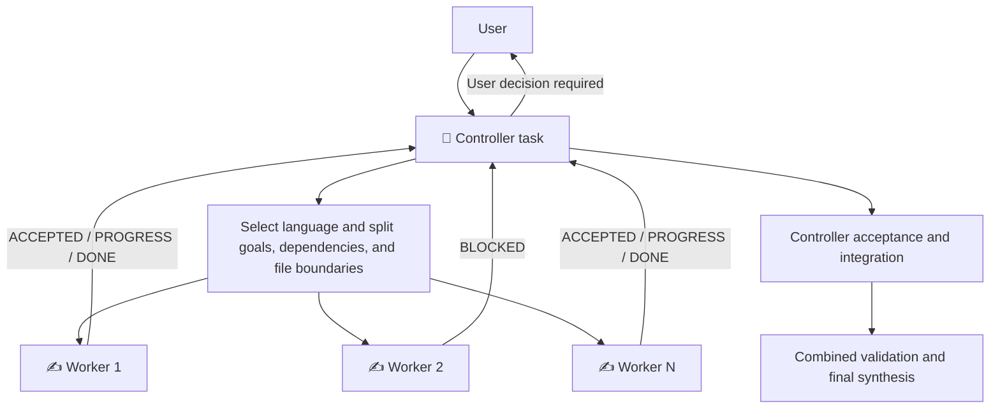

**English** | [中文](README.zh-CN.md)

# Codex Task Orchestrator

`orchestrate-codex-tasks` is a Codex Skill that turns the current task into the single Controller, creates independently visible Worker tasks, and coordinates dispatch, blockers, acceptance, and result synthesis through cross-task messages.

> Workers are independent Codex tasks, not Codex subagents.

## 1. Installation

### Recommended: let Codex install the Skill

Send this in any Codex task:

```text
Use $skill-installer to install this Skill from:
https://github.com/BillSJC/orchestrate-codex-tasks/tree/master/.agents/skills/orchestrate-codex-tasks
```

Use `$orchestrate-codex-tasks` in a new task after installation. If the Skill does not appear immediately, restart Codex and check again.

You can confirm the installation without creating Workers:

```text
Confirm that $orchestrate-codex-tasks is loaded and summarize its trigger conditions.
Do not create any Workers.
```

### Repository-scoped installation

Copy the Skill directory from this repository to the same location in the target repository:

```text
<target-repo>/.agents/skills/orchestrate-codex-tasks/
```

Codex can discover it when launched from that repository or one of its subdirectories.

### Manual user-level installation

You can also copy or symlink the Skill directory to:

```text
$HOME/.agents/skills/orchestrate-codex-tasks/
```

For private GitHub repositories, use credentials already configured on the machine. Do not paste access tokens or private keys into a normal Codex Prompt.

## 2. When and How to Use It

### Good use cases

- The work can be divided into two or more clearly bounded subtasks with independent acceptance criteria.
- You want multiple Codex tasks to progress in the background and remain individually visible and interactive.
- You want one Controller to own scope, dependencies, decisions, conflicts, and final acceptance.
- Workers need to research different topics, inspect separate modules, or write code in isolated worktrees.
- You need local or remote-host execution while keeping coordination in the current Controller task.

### Poor use cases

- A small, single-step task or work that must be strictly sequential.
- Highly coupled subtasks that repeatedly modify the same interface or files.
- Ordinary process, test, or shell-command concurrency.
- A request specifically asking for Codex subagents rather than independent tasks.
- Vague signals such as “make it faster” or “can this run in parallel” that do not clearly authorize new tasks.

### Deterministic invocation

The most reliable approach is to name the Skill:

```text
Use $orchestrate-codex-tasks to split the following work into independent Codex Worker tasks.
Coordinate, validate, and synthesize their results from the current task: ...
```

You can also use explicit natural language:

```text
Create several independent Codex tasks to complete this work in parallel.
Use a Controller + Worker workflow and coordinate them through cross-task messages.
```

### Set the concurrency limit

The default limit is 8 active Workers, but the Skill does not create low-value tasks merely to fill all 8 slots. Set another limit when starting:

```text
Use $orchestrate-codex-tasks for the following work with at most 4 active Workers: ...
```

You can also adjust the limit during a run:

```text
Reduce the maximum active Workers from 8 to 3.
```

Lowering the limit does not interrupt Workers that are already running. It pauses new dispatches until the active count falls within the new limit.

### Select the code baseline

Code-writing Workers create isolated worktrees from the project default branch by default. If they must see current uncommitted changes, say so explicitly:

```text
Create Worker worktrees from the current working tree, not the project default branch.
```

### Conversation language

The Skill selects the coordination language from the user's orchestration request:

- English request: the Controller, Worker titles, progress, blockers, and synthesis run in English.
- Chinese request: the entire coordination flow runs in Chinese.
- Code, paths, quoted material, and the requested deliverable language do not affect detection.
- A deliverable can use another language without changing the coordination language.
- The coordination language changes during a run only when the user explicitly requests a switch.

For example, an English request for a Chinese README keeps coordination in English while producing the README in Chinese.

## 3. What You Will See

After dispatch, the Codex task list forms a visible Controller and Worker group:

```text
👑 [R7K2] Tracking 3 Workers | Prepare the release
├── ✍️ [R7K2-W1] Verify the installation flow
├── ⌛️ [R7K2-W2] Implement the release script | Waiting for a target environment
└── ✅ [R7K2-W3] Review safety boundaries
```

| Marker | Meaning |
|---|---|
| `👑` | The current task is the single Controller responsible for decisions, monitoring, acceptance, and synthesis |
| `✍️` | The Worker is running, revising, or waiting for Controller acceptance |
| `⌛️` | The Worker is blocked by a decision, clarification, permission, dependency, or failure |
| `✅` | The Worker is complete and has passed Controller acceptance |

You can expect:

- An immediate dispatch report with Worker names, objectives, active and queued counts, concurrency limit, and execution location.
- Worker messages when a task is accepted, reaches a substantive milestone, becomes blocked, or finishes.
- Active monitoring by the Controller and timely reports of meaningful changes.
- A paused affected Worker plus facts, options, and a recommendation when user input is required.
- Independent Controller verification after a Worker reports `DONE`; `✅` appears only after acceptance.
- Isolated worktrees for code-writing Workers by default, reducing concurrent-edit conflicts.
- Completed tasks that remain visible and are never automatically archived.

## 4. How It Works



The core workflow is:

1. **Authorization gate:** Workers are created only after explicit Skill invocation or a clear request for independent-task concurrency or a Controller + Worker workflow.
2. **Language and addressing:** The Controller selects `runLanguage`, generates a run ID, and resolves its own `threadId`; cross-host runs also record `hostId`.
3. **Decomposition and dispatch:** The Controller builds dependency-aware subtasks, selects the matching Worker Prompt language, and injects scope, prohibitions, file boundaries, and acceptance criteria.
4. **Two-way coordination:** Workers send `ACCEPTED`, `PROGRESS`, `BLOCKED`, and `DONE`; the Controller also observes tasks through wait and read capabilities.
5. **Blocker decisions:** Workers pause instead of guessing about product, architecture, permission, or risk decisions and send options back to the Controller.
6. **Acceptance and integration:** The Controller checks deliverables and validation evidence. Code results are handed back in dependency order and validated together.
7. **Completion without archiving:** Accepted Workers receive `✅`, all tasks remain visible, and the Controller delivers the final result.

## 5. Safety Boundaries and Defaults

| Area | Default behavior |
|---|---|
| Worker type | Independent Codex task, not a subagent |
| Coordination language | Matches the user's orchestration request; English and Chinese are supported |
| Decision authority | The Controller owns scope, conflicts, and final acceptance |
| Maximum active Workers | 8 by default; adjustable before or during a run |
| Code writes | Prefer isolated worktrees with explicit file boundaries |
| Host selection | Prefer local execution; support an explicit remote `hostId` |
| Commits and publishing | Do not commit, push, open PRs, or publish unless the original request authorizes it |
| Permissions | Do not bypass approvals, sandboxes, credentials, or external-write restrictions |
| Worker expansion | Workers may not create subagents, other tasks, or additional Workers |
| Completion | A Worker `DONE` message requires Controller acceptance |
| Automatic archiving | Prohibited; `✅` means complete, not archived |

## 6. Runtime Requirements and Compatibility

The active Codex surface must support:

- Creating, listing, reading, waiting for, and renaming independent tasks.
- Sending messages to another task.
- Discovering projects and execution hosts.
- For code-writing workflows, worktrees and Handoff, or another result-recovery method explicitly accepted by the user.

If a preflight check finds that a required capability is missing, the Skill stops before creating Workers and reports the missing capability instead of pretending orchestration is active.

Runtime tool names and schemas may change between Codex versions. The Skill uses the actual callable schema first; the bundled tool contract documents expected capabilities and safe fallback boundaries.

## 7. Project Structure and Further Reading

```text
.agents/
└── skills/
    └── orchestrate-codex-tasks/
        ├── SKILL.md
        ├── agents/
        │   └── openai.yaml
        └── references/
            ├── protocol.md
            ├── tool-contracts.md
            ├── worker-prompt.en.md
            └── worker-prompt.zh-CN.md
```

- [Detailed design (Chinese)](DESIGN.md)
- [Skill workflow](.agents/skills/orchestrate-codex-tasks/SKILL.md)
- [Controller/Worker protocol](.agents/skills/orchestrate-codex-tasks/references/protocol.md)
- [Independent-task tool contract](.agents/skills/orchestrate-codex-tasks/references/tool-contracts.md)
