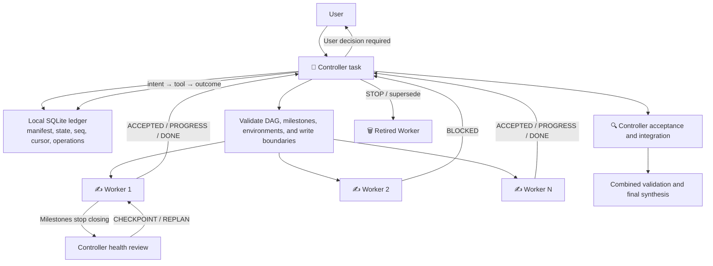

**English** | [中文](README.zh-CN.md)

# Codex Task Orchestrator

`orchestrate-codex-tasks` is a Codex Skill that turns the current task into the single Controller, creates independently visible Worker tasks, and coordinates dispatch, blockers, acceptance, recovery, and result synthesis through cross-task messages and a durable local SQLite ledger.

> Workers are independent Codex tasks, not Codex subagents.

## 1. What You Will See

After dispatch, the Codex task list forms a visible Controller and Worker group:

```text
👑 [R7K2] Tracking 5 Workers | Prepare the release
├── ✍️ [R7K2-W1] Implement the release script
├── 🔍 [R7K2-W2] Verify update instructions | Awaiting Controller acceptance
├── ⌛️ [R7K2-W3] Test deployment | Waiting for a target environment
├── ✅ [R7K2-W4] Review safety boundaries | Accepted, no integration artifact
└── 🗑️ [R7K2-W5] Review the old candidate | Superseded by W6
```

| Marker | Meaning |
|---|---|
| `👑` | The current task is the single Controller responsible for decisions, monitoring, acceptance, and synthesis |
| `✍️` | The Worker is running or revising |
| `🔍` | The Worker reported `DONE`; the Controller is validating or integrating the result |
| `⌛️` | The Worker is blocked by a decision, clarification, permission, dependency, or failure |
| `✅` | The Worker completed its Prompt scope, passed the archive-readiness gate, and is safe to archive manually |
| `🗑️` | The Worker was cancelled, retired, invalidated, or superseded, passed the archive-readiness gate, and is safe to archive manually |

Markers describe lifecycle, not deliverable type. A validated report, audit, design, DAG, or candidate package can receive `✅` even when it has no code or merge artifact. The Skill does not use `📋` as a state.

You can expect:

- An immediate dispatch report with Worker names, objectives, active and queued counts, concurrency limit, and execution location.
- Worker messages when a task is accepted, reaches a substantive milestone, becomes blocked, or finishes.
- Active monitoring by the Controller and timely reports of meaningful changes.
- A private SQLite run ledger under the project’s ignored `.codex/runtime/orchestrate-codex-tasks/` directory, so task plans, addresses, sequence numbers, cursors, decisions, and acceptance state survive context compaction.
- Idempotent operation tracking around task creation, cross-task messages, title changes, and Handoff, preventing an ambiguous timeout from silently creating or sending the same work twice.
- A paused affected Worker plus facts, options, and a recommendation when user input is required.
- Health checks that distinguish useful milestone closure from frequent messages, then request a safe checkpoint when a Worker becomes too broad, repetitive, or slow.
- Adaptive replanning that can batch-authorize a reviewed test manifest, remove redundant execution, or split independent remaining work without weakening acceptance.
- `🔍` after a Worker reports `DONE`; `✅` appears only after independent Controller acceptance and result recovery.
- `🗑️` only after useful results are recovered or intentionally rejected and any replacement Worker is recorded.
- Isolated worktrees for code-writing Workers by default, reducing concurrent-edit conflicts.
- `✅` and `🗑️` tasks that remain visible and are never automatically archived; either marker means the user may archive the task manually.

Health is separate from lifecycle markers. During an efficiency review, the Controller may use `👑 [R7K2] Replanning | ...`; a Worker stays `✍️ ... | Efficiency review` while progressing or becomes `⌛️ ... | Waiting for replanning` when paused. Time thresholds trigger review only—they never automatically stop or retire a Worker.

## 2. Installation and Updates

### Recommended: let Codex install the Skill

Send this in any Codex task:

```text
Use $skill-installer to install this Skill from:
https://github.com/BillSJC/orchestrate-codex-tasks/tree/master/.agents/skills/orchestrate-codex-tasks
```

Use `$orchestrate-codex-tasks` in a new task after installation. If the Skill does not appear immediately, restart Codex and check again.

The installer copies the bundled Python dispatch/ledger CLIs and SQL schema with the Skill. No third-party Python package is required.

You can confirm the installation without creating Workers:

```text
Confirm that $orchestrate-codex-tasks is loaded and summarize its trigger conditions.
Do not create any Workers.
```

### Repository-scoped installation

Copy the Skill directory from this repository to the same location in the target repository:

```text
<target-repo>/.agents/skills/orchestrate-codex-tasks/
```

Codex can discover it when launched from that repository or one of its subdirectories.

### Manual user-level installation

You can also copy or symlink the Skill directory to:

```text
$HOME/.agents/skills/orchestrate-codex-tasks/
```

For private GitHub repositories, use credentials already configured on the machine. Do not paste access tokens or private keys into a normal Codex Prompt.

### Update an existing installation

For a repository-scoped copy, update the repository checkout that contains `.agents/skills/orchestrate-codex-tasks`. Codex detects Skill file changes automatically; restart Codex if the updated instructions do not appear.

For a user-level copy installed through `$skill-installer`, do not install over the existing directory: the installer stops when the destination already exists. Move the old copy to a backup location outside every Skill scan root, then install the GitHub URL again. The built-in installer uses `$CODEX_HOME/skills` (typically `$HOME/.codex/skills`); a manually authored user copy may instead be under `$HOME/.agents/skills`.

You can ask Codex to perform the safe replacement:

```text
Safely update the user-level $orchestrate-codex-tasks installation.
Move the existing copy to a backup directory outside all Skill scan roots; do not delete it.
Then use $skill-installer to reinstall from:
https://github.com/BillSJC/orchestrate-codex-tasks/tree/master/.agents/skills/orchestrate-codex-tasks
Confirm that no stale duplicate user-level copy remains discoverable.
Do not create any Workers.
```

Do not leave a backup containing the same `SKILL.md` inside `.agents/skills`, `$HOME/.agents/skills`, or `$CODEX_HOME/skills`. Codex does not merge Skills with the same `name`; duplicate copies can expose different versions. After validating the update in a new task, remove the external backup only when you no longer need rollback.

## 3. When and How to Use It

### Good use cases

- The work can be divided into two or more clearly bounded subtasks with independent acceptance criteria.
- You want multiple Codex tasks to progress in the background and remain individually visible and interactive.
- You want one Controller to own scope, dependencies, decisions, conflicts, and final acceptance.
- Workers need to research different topics, inspect separate modules, or write code in isolated worktrees.
- You need local or remote-host execution while keeping coordination in the current Controller task.

### Poor use cases

- A small, single-step task or work that must be strictly sequential.
- Highly coupled subtasks that repeatedly modify the same interface or files.
- Ordinary process, test, or shell-command concurrency.
- A request specifically asking for Codex subagents rather than independent tasks.
- Vague signals such as “make it faster” or “can this run in parallel” that do not clearly authorize new tasks.

### Deterministic invocation

The most reliable approach is to name the Skill:

```text
Use $orchestrate-codex-tasks to split the following work into independent Codex Worker tasks.
Coordinate, validate, and synthesize their results from the current task: ...
```

You can also use explicit natural language:

```text
Create several independent Codex tasks to complete this work in parallel.
Use a Controller + Worker workflow and coordinate them through cross-task messages.
```

The Controller will create a private, Git-ignored runtime ledger in the project. Do not put credentials, tokens, private keys, or raw sensitive tool output in the orchestration request or dispatch manifest.

### Set the concurrency limit

The default limit is 8 active Workers, but the Skill does not create low-value tasks merely to fill all 8 slots. Set another limit when starting:

```text
Use $orchestrate-codex-tasks for the following work with at most 4 active Workers: ...
```

You can also adjust the limit during a run:

```text
Reduce the maximum active Workers from 8 to 3.
```

Lowering the limit does not interrupt Workers that are already running. It pauses new dispatches until the active count falls within the new limit.

### Select the code baseline

Code-writing Workers create isolated worktrees from the project default branch by default. If they must see current uncommitted changes, say so explicitly:

```text
Create Worker worktrees from the current working tree, not the project default branch.
```

### Conversation language

The Skill selects the coordination language from the user's orchestration request:

- English request: the Controller, Worker titles, progress, blockers, and synthesis run in English.
- Chinese request: the entire coordination flow runs in Chinese.
- Code, paths, quoted material, and the requested deliverable language do not affect detection.
- A deliverable can use another language without changing the coordination language.
- The coordination language changes during a run only when the user explicitly requests a switch.

For example, an English request for a Chinese README keeps coordination in English while producing the README in Chinese.

## 4. How It Works



The core workflow is:

1. **Authorization gate:** Workers are created only after explicit Skill invocation or a clear request for independent-task concurrency or a Controller + Worker workflow.
2. **Language and addressing:** The Controller selects `runLanguage`, generates a run ID, and resolves its own `threadId`; cross-host runs also record `hostId`.
3. **Durable planning:** A deterministic CLI validates and compiles the Worker DAG, worktree policy, milestones, acceptance criteria, and write boundaries; the Controller atomically activates it in the local SQLite ledger.
4. **Idempotent dispatch:** Before creating a task, sending a message, changing a title, or starting Handoff, the Controller records an intent. It records the sanitized outcome only after calling the real Codex tool.
5. **Two-way coordination:** Workers send `ACCEPTED`, `PROGRESS`, `BLOCKED`, and `DONE`; the Controller also observes tasks through wait and read capabilities and persists each accepted message and cursor.
6. **Health and replanning:** The Controller tracks closed acceptance items, scope growth, serial decision round trips, timeouts, and one-to-one tail work. Soft thresholds cause `CHECKPOINT`, then a bounded `REPLAN` when useful.
7. **Blocker decisions:** Workers pause instead of guessing about product, architecture, permission, or risk decisions and send options back to the Controller.
8. **Acceptance and integration:** The Controller checks deliverables and validation evidence. Code results are handed back in dependency order and validated together.
9. **Recovery:** After context compaction or restart, the Controller verifies the ledger, reconciles pending operations with visible task facts, restores the current manifest, and resumes without duplicating Workers.
10. **Terminal state without automatic archiving:** Accepted Workers receive `✅`; cancelled or superseded Workers receive `🗑️`. Both are safe for manual archiving after the archive-readiness gate, but the Skill keeps them visible.

## 5. Safety Boundaries and Defaults

| Area | Default behavior |
|---|---|
| Worker type | Independent Codex task, not a subagent |
| Coordination language | Matches the user's orchestration request; English and Chinese are supported |
| Decision authority | The Controller owns scope, conflicts, and final acceptance |
| Durable state | Private local SQLite ledger; Controller is the sole writer |
| External side effects | Idempotent `intent → actual tool → sanitized outcome` |
| Maximum active Workers | 8 by default; adjustable before or during a run |
| Code writes | Prefer isolated worktrees with explicit file boundaries |
| Host selection | Prefer local execution; support an explicit remote `hostId` |
| Commits and publishing | Do not commit, push, open PRs, or publish unless the original request authorizes it |
| Permissions | Do not bypass approvals, sandboxes, credentials, or external-write restrictions |
| Worker expansion | Workers may not create subagents, other tasks, or additional Workers |
| Efficiency review | Soft thresholds request a safe checkpoint; they do not automatically stop a Worker or weaken validation |
| Replanning | May batch safe steps or split independent work within the original authorization; a dirty worktree must be checkpointed before another writer takes over |
| Completion | A Worker `DONE` message enters `🔍`; Controller acceptance and result recovery are required for `✅` |
| Retirement | Cancelled or superseded work receives `🗑️` only after useful-result disposition and replacement tracking |
| Automatic archiving | Prohibited; `✅` and `🗑️` are terminal, manually archive-ready states |

## 6. Local Ledger, Recovery, and Privacy

For a project run, the default database is:

```text
<project>/.codex/runtime/orchestrate-codex-tasks/runs/<runId>/ledger.sqlite3
```

The initializer adds the runtime directory to the repository-local `.git/info/exclude`; it does not modify the tracked `.gitignore`. The ledger and its backups must stay local and must never be committed or uploaded automatically.

Only the Controller writes the database through the bundled `ledger.py`. Workers cannot access it and report through structured cross-task messages instead. The database stores normalized task specifications, lifecycle and health state, stable IDs, message sequences, wait cursors, decisions, integration status, and an append-only event trail. Operation requests and outcomes use closed, minimal field sets; verification checks SQLite integrity, foreign keys, revisions, hashes, addresses, sequences, and terminal-state invariants. It deliberately rejects secret-like keys and values, but that is a final safeguard—not permission to persist raw credentials or logs.

On recovery, the Controller runs ledger integrity, status, pending-operation, and observed-task audits before doing more work. If the ledger cannot be safely initialized, it does not dispatch Workers. If a ledger write fails mid-run, it stops new external side effects, reports degraded state, and reconciles or restores a verified backup before resuming.

## 7. Runtime Requirements and Compatibility

The scripts require Python 3.9 or newer with the standard-library `sqlite3` module. They have no third-party package dependency.

The active Codex surface must support:

- Creating, listing, reading, waiting for, and renaming independent tasks.
- Sending messages to another task.
- Discovering projects and execution hosts.
- For code-writing workflows, worktrees and Handoff, or another result-recovery method explicitly accepted by the user.

If a preflight check finds that a required capability is missing, the Skill stops before creating Workers and reports the missing capability instead of pretending orchestration is active.

Runtime tool names and schemas may change between Codex versions. The Skill uses the actual callable schema first; the bundled tool contract documents expected capabilities and safe fallback boundaries.

## 8. Project Structure and Further Reading

```text
.agents/
└── skills/
    └── orchestrate-codex-tasks/
        ├── SKILL.md
        ├── agents/
        │   └── openai.yaml
        ├── references/
        │   ├── dispatch.md
        │   ├── ledger.md
        │   ├── protocol.md
        │   ├── tool-contracts.md
        │   ├── worker-prompt.en.md
        │   └── worker-prompt.zh-CN.md
        └── scripts/
            ├── dispatch.py
            ├── ledger.py
            ├── orchestration_common.py
            └── sql/
                └── 001_initial.sql
```

- [Detailed design (Chinese)](DESIGN.md)
- [Skill workflow](.agents/skills/orchestrate-codex-tasks/SKILL.md)
- [Controller/Worker protocol](.agents/skills/orchestrate-codex-tasks/references/protocol.md)
- [Independent-task tool contract](.agents/skills/orchestrate-codex-tasks/references/tool-contracts.md)
- [Dispatch manifest and renderer](.agents/skills/orchestrate-codex-tasks/references/dispatch.md)
- [Durable local ledger](.agents/skills/orchestrate-codex-tasks/references/ledger.md)
