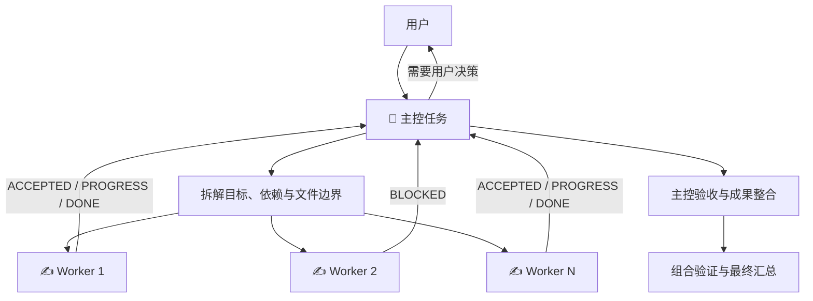

[English](README.md) | **中文**

# Codex Task Orchestrator

`orchestrate-codex-tasks` 是一个 Codex Skill。它把当前任务作为唯一主控（Controller），创建多个可在任务列表中独立存在的 Worker 任务，并通过跨任务消息完成派发、阻塞处理、验收和结果汇总。

> Worker 是独立 Codex 任务，不是 Codex 子 Agent。

## 1. 安装

### 推荐：让 Codex 自动安装

在任意 Codex 任务中发送：

```text
请使用 $skill-installer，从下面的 GitHub 地址安装这个 Skill：
https://github.com/BillSJC/orchestrate-codex-tasks/tree/master/.agents/skills/orchestrate-codex-tasks
```

安装完成后，在新的任务中使用 `$orchestrate-codex-tasks`。如果 Skill 没有立即出现，重启 Codex 后再检查。

可以用下面的 Prompt 做一次无副作用确认：

```text
请确认你已加载 $orchestrate-codex-tasks，并概述它的触发条件；不要创建 Worker。
```

### 仅在某个仓库中使用

把本仓库中的 Skill 目录复制到目标仓库的相同位置：

```text
<target-repo>/.agents/skills/orchestrate-codex-tasks/
```

Codex 从该仓库或其子目录启动时即可发现它。

### 用户级手动安装

也可以把 Skill 目录复制或链接到：

```text
$HOME/.agents/skills/orchestrate-codex-tasks/
```

私有 GitHub 仓库应使用机器上已有的 GitHub 凭据。不要把访问令牌或私钥粘贴到普通 Codex Prompt 中。

## 2. 何时使用，如何使用

### 适合使用

- 一项工作能拆成两个或更多边界清晰、可以独立验收的子任务。
- 希望多个 Codex 任务在后台并行推进，并在任务列表中分别查看或继续交流。
- 希望由一个主控统一处理范围、依赖、决策、冲突和最终验收。
- 多个 Worker 需要分别研究资料、分析不同模块，或在独立 worktree 中编写代码。
- 需要跨本地或远程主机调度，同时让结果回到当前主控任务。

### 不适合使用

- 单一、短小或必须严格串行完成的工作。
- 子任务高度耦合，多个执行者会频繁修改同一接口或同一批文件。
- 只是希望普通程序、测试或 shell 命令并发运行。
- 用户明确要求的是 Codex 子 Agent，而不是独立任务。
- 只有“快一点”“能不能并行”等模糊信号，尚未明确授权创建新任务。

### 确定性触发

最可靠的方式是直接点名 Skill：

```text
使用 $orchestrate-codex-tasks，把下面工作拆成独立 Codex Worker 任务并发执行，
由当前任务统一协调、验收和汇总：……
```

也可以使用明确的自然语言：

```text
创建几个独立 Codex 任务并行完成这些工作。
使用主控 + Worker 模式，由当前任务通过跨任务消息统一协调。
```

### 设置并发度

默认最多有 8 个活跃 Worker，但不会为了填满 8 个槽位而制造无意义任务。可以在开始时指定其他上限：

```text
使用 $orchestrate-codex-tasks 执行下面任务，最大活跃 Worker 设置为 4：……
```

运行中也可以要求主控调整上限：

```text
把最大活跃 Worker 从 8 调整为 3。
```

降低上限不会自动中断已经运行的 Worker，只会暂停新的派发。

### 指定代码基线

写代码的 Worker 默认从项目默认分支创建独立 worktree。如果任务必须看到当前未提交修改，需要明确说明：

```text
Worker 必须以当前 working tree 为起点，而不是项目默认分支。
```

### 会话语言

Skill 会根据触发编排的用户请求选择协调语言：

- 中文请求：主控、Worker 标题、进度、阻塞和汇总使用中文。
- 英文请求：整个协调流程使用英文。
- 代码、路径、引用内容和交付物目标语言不参与判断。
- 交付物可以使用不同语言，不会改变协调语言。
- 运行中只有用户明确要求时才切换协调语言。

例如，用中文要求生成英文 README 时，主控与 Worker 仍使用中文沟通，README 使用英文。

## 3. 使用效果

启动后，Codex 任务列表会形成一个可见的主控与 Worker 集合，例如：

```text
👑 [R7K2] 跟进 3 个 Worker｜完成发布准备
├── ✍️ [R7K2-W1] 检查安装流程
├── ⌛️ [R7K2-W2] 实现发布脚本｜等待用户确认目标环境
└── ✅ [R7K2-W3] 审核安全边界
```

| 标记 | 含义 |
|---|---|
| `👑` | 当前任务是唯一主控，负责决策、监控、验收和汇总 |
| `✍️` | Worker 正在执行或等待主控验收 |
| `⌛️` | Worker 因决策、澄清、权限、依赖或故障而阻塞 |
| `✅` | Worker 已完成，并通过主控验收 |

用户可以预期看到：

- 派发后立即收到 Worker 名称、目标、活跃数、排队数、并发上限和运行位置。
- Worker 在接受任务、取得实质进展、发生阻塞和完成时通知主控。
- 主控持续观察全部活跃 Worker，并及时汇报关键变化。
- 需要用户决定时，受影响的 Worker 暂停，主控给出事实、选项和建议。
- Worker 自称完成后，主控仍会独立检查证据；通过后才标记为 `✅`。
- 写代码的 Worker 默认在相互隔离的 worktree 中工作，减少并发修改冲突。
- 完成的任务保留在任务列表中，不会被自动归档。

## 4. 使用原理



核心流程如下：

1. **授权判断**：只有显式调用 Skill，或用户明确要求“独立任务并发”“主控 + Worker”等模式时，才允许创建 Worker。
2. **语言与寻址**：主控确定 `runLanguage`，生成运行标识，并取得自己的 `threadId`；跨主机时同时记录 `hostId`。
3. **拆解与派发**：主控将工作整理成带依赖关系的子任务，选择匹配语言的 Worker Prompt，并写入范围、禁止事项、文件边界和验收条件。
4. **双向协调**：Worker 使用 `ACCEPTED`、`PROGRESS`、`BLOCKED` 和 `DONE` 消息主动回报；主控同时通过任务等待和读取能力主动观察。
5. **阻塞决策**：Worker 不自行猜测产品、架构、权限或风险决策，而是暂停受影响工作并把选项发回主控。
6. **验收与回收**：主控核对交付物和测试证据。代码成果按依赖顺序回收到本地，并完成组合验证。
7. **完成但不归档**：通过验收的 Worker 标记为 `✅`；所有任务继续保留，最终结果由主控统一交付。

## 5. 安全边界与默认策略

| 项目 | 默认行为 |
|---|---|
| Worker 类型 | 独立 Codex 任务，不是子 Agent |
| 协调语言 | 匹配触发编排的用户请求，支持英文和中文 |
| 决策中心 | 只有主控可以处理范围、冲突和最终验收 |
| 最大活跃 Worker | 默认 8，用户可以在运行前或运行中调整 |
| 代码写入 | 优先使用独立 worktree，并声明文件边界 |
| 主机选择 | 本地主机优先，也支持明确的远程 `hostId` |
| 提交与发布 | 不自动 commit、push、开 PR 或发布，除非原请求明确授权 |
| 权限 | 不绕过审批、沙箱、凭据或外部写入限制 |
| Worker 扩散 | Worker 不得创建子 Agent、其他任务或新的 Worker |
| 完成标准 | Worker 的 `DONE` 必须经过主控验收 |
| 自动归档 | 严禁；`✅` 只表示完成，不表示归档 |

## 6. 运行要求与兼容性

当前 Codex 表面需要提供：

- 创建、列出、读取、等待和改名独立任务的能力。
- 向其他任务发送消息的能力。
- 项目与执行主机发现能力。
- 对于代码任务，还需要 worktree 和 Handoff，或由用户明确认可其他成果回收方式。

如果预检发现关键能力不可用，Skill 会停止创建 Worker 并说明缺失项，不会假装已经进入编排模式。

运行时暴露的工具名称和参数可能随 Codex 版本变化。Skill 会优先使用当前实际工具 schema，仓库中的工具契约用于说明预期能力和降级边界。

## 7. 项目结构与进一步阅读

```text
.agents/
└── skills/
    └── orchestrate-codex-tasks/
        ├── SKILL.md
        ├── agents/
        │   └── openai.yaml
        └── references/
            ├── protocol.md
            ├── tool-contracts.md
            ├── worker-prompt.en.md
            └── worker-prompt.zh-CN.md
```

- [详细设计](DESIGN.md)
- [Skill 主流程](.agents/skills/orchestrate-codex-tasks/SKILL.md)
- [Controller/Worker 协议](.agents/skills/orchestrate-codex-tasks/references/protocol.md)
- [独立任务工具契约](.agents/skills/orchestrate-codex-tasks/references/tool-contracts.md)
